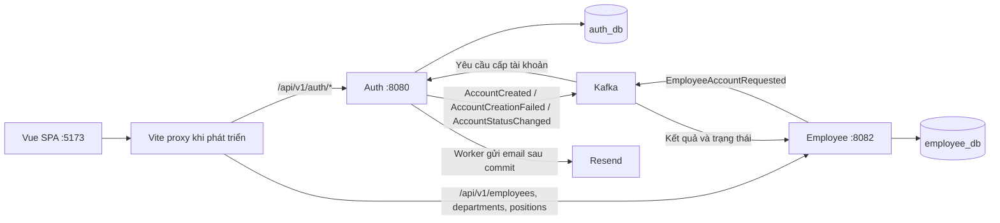

# Company HRM — Kiến trúc hiện tại và định hướng phát triển

Tài liệu mô tả hiện trạng repository, các quyết định thiết kế và roadmap nghiệp vụ. **Có trong roadmap không đồng nghĩa đã triển khai.** Các mục Attendance, Leave, Shift và Device bên dưới là yêu cầu cho các bước tiếp theo; hiện hệ thống đang có nền tảng Auth, Employee và giao diện quản trị.

## 1. Bối cảnh dự án

Đây là dự án xây dựng một hệ thống **Human Resource Management (HRM)** cho doanh nghiệp.

Mục tiêu ban đầu là xây dựng hệ thống quản lý **Attendance / Check-in / Check-out**, sau đó mở rộng thành một nền tảng quản lý nhân sự và employee experience.

**Mục tiêu release tiếp theo: v0.1 — Attendance MVP**, cho phép nhân viên chấm công hằng ngày và HR kiểm tra, điều chỉnh công khi có sai sót. Hiện chưa có backend chấm công hoặc phân ca; nền tảng quản lý nhân viên và cấp tài khoản đang được xây trước. Phạm vi và tiêu chí hoàn thành từng release được quy định tại mục 22.

Phạm vi mặc định của MVP: một công ty, timezone `Asia/Ho_Chi_Minh`, một ca trong ngày cho mỗi nhân viên, web responsive và xác thực chấm công qua mạng công ty. Timezone là cấu hình nghiệp vụ; chưa triển khai multi-tenant, ca qua đêm hoặc nhiều ca/ngày trong v0.1.

Các nghiệp vụ dự kiến:

- Employee Management
- Employee Profile
- Organization / Department / Team
- Position / Job Title
- Attendance
- Check-in / Check-out
- Work Shift
- Overtime
- Leave Management
- Leave Request / Approval
- Company Holiday / Company Calendar
- Attendance Report
- Leave Balance
- Device Management
- Notification
- Sau này có thể mở rộng Payroll, Recruitment, Performance Management và các nghiệp vụ HR khác.

---

## 2. Kiến trúc hiện tại

### Thành phần và cấu trúc repository

Hệ thống hiện sử dụng **kiến trúc microservices**, gồm Auth Service và Employee Service là hai ứng dụng Spring Boot có thể build và chạy độc lập, mỗi service sở hữu database riêng. Hai service trao đổi sự kiện qua Kafka; frontend Vue gọi API của service phụ trách nghiệp vụ tương ứng.

Mã nguồn được tổ chức trong **monorepo**. Monorepo mô tả cách lưu trữ mã nguồn, còn microservices mô tả kiến trúc ứng dụng; hai khái niệm này không mâu thuẫn. Mỗi service có Maven project, cấu hình, database và transaction riêng. Kiến trúc hiện tại đã thay thế định hướng Modular Monolith ban đầu.

```text
company-hrm/
├── frontend/                         # Vue 3, Vue Router, Vite
└── back-end/modules/
    ├── auth-service-main/            # Ứng dụng Maven/Spring Boot riêng
    ├── employee-service/             # Ứng dụng Maven/Spring Boot riêng
    └── infra/kafka/                  # Docker Compose và khởi tạo topics local
```

| Thành phần | Trách nhiệm hiện tại | Cấu hình local mặc định |
| --- | --- | --- |
| Frontend | Đăng nhập, workspace, hồ sơ nhân viên, danh mục, theo dõi cấp tài khoản | Vite `:5173` |
| Auth Service | Tài khoản, vai trò, JWT, refresh session, kích hoạt và email lời mời | HTTP `:8080`, PostgreSQL `auth_db` |
| Employee Service | Nhân viên, phòng ban, chức danh, yêu cầu cấp tài khoản và trạng thái đồng bộ | HTTP `:8082`, PostgreSQL `employee_db` |
| Kafka | Truyền yêu cầu/kết quả cấp tài khoản và trạng thái sau kích hoạt | Host `localhost:9092` |
| Resend | Gửi email kích hoạt qua worker của Auth khi được bật | Dịch vụ ngoài, cấu hình tại Auth |

Hai database có thể chạy trên cùng PostgreSQL local nhưng được quản lý bằng tài khoản và schema dữ liệu riêng. Thư mục `modules` không có nghĩa hai service dùng chung Spring context hoặc transaction.



Employee tự xác minh access JWT bằng public key của Auth; không gọi HTTP về Auth cho mỗi request. Sơ đồ dùng proxy local; production cần reverse proxy riêng. Chưa có API Gateway, service discovery hay cấu hình triển khai toàn hệ thống trong repository. API Gateway và service discovery không phải điều kiện bắt buộc để được coi là microservices; khả năng vận hành production cần được đánh giá riêng với kiểu kiến trúc.

### Mức độ triển khai

| Phần hệ thống | Hiện trạng |
| --- | --- |
| Auth | Có login, refresh rotation, logout/logout-all, `/me`, cấp tài khoản và kích hoạt |
| Employee / Organization | Có tạo, đọc, sửa nhân viên; đổi trạng thái; danh mục phòng ban và chức danh |
| Cấp tài khoản qua Kafka | Có request, outbox, consumer chống trùng, kết quả và UI polling |
| Email kích hoạt | Có token, mail outbox, worker Resend, trang đặt mật khẩu và đồng bộ trạng thái |
| Calendar | Có giao diện đọc dữ liệu JSON mẫu; chưa có backend Holiday/Leave |
| Attendance / Shift | Chưa triển khai; là trọng tâm nghiệp vụ tiếp theo |
| Hồ sơ mở rộng / Payroll / Recruitment / Performance | Chưa triển khai; thuộc roadmap |

Có implementation không có nghĩa môi trường đã bật đủ tính năng hoặc đã nghiệm thu production. Các cờ cấu hình, schema, khóa JWT và hạ tầng phải được chuẩn bị theo hướng dẫn từng service.

### Luồng cấp và kích hoạt tài khoản

1. HR/Admin tạo hồ sơ tại Employee. Hồ sơ tồn tại độc lập với tài khoản đăng nhập.
2. Frontend gửi `POST /api/v1/employees/{employeeId}/account-requests` với `Idempotency-Key`. Employee lưu yêu cầu và event outbox trong cùng transaction, trả `202 Accepted` cùng địa chỉ theo dõi.
3. Worker gửi `EmployeeAccountRequested` lên `hrm.employee.account-requests.v1`. Auth nhận yêu cầu, chống trùng và tạo tài khoản chờ kích hoạt; luồng này cấp role `EMPLOYEE`.
4. Auth lưu kết quả và outbox trong transaction của Auth, rồi phát `AccountCreated` hoặc `AccountCreationFailed` lên `hrm.auth.account-results.v1`. Employee cập nhật yêu cầu; frontend polling để lấy kết quả.
5. Nếu bật activation, Auth tạo token và mail outbox cùng transaction tạo tài khoản. Worker gửi email qua Resend sau commit. Cấp tài khoản thành công chưa đồng nghĩa đã gửi email hoặc đã kích hoạt.
6. Nhân viên mở trang `/activate` do Auth phục vụ và đặt mật khẩu. Auth kích hoạt tài khoản, ghi outbox `AccountStatusChanged` lên `hrm.auth.account-lifecycle.v1`; Employee cập nhật `accountStatus` theo version sự kiện.

Luồng liên service nhất quán sau khi xử lý sự kiện (eventual consistency), không dùng transaction chung cho hai database. Producer có thể gửi lại sau lỗi; consumer phải chống trùng và không cho sự kiện cũ ghi đè trạng thái mới. Hiện consumer retry lỗi chưa có dead-letter topic (DLT).

### Ranh giới và hướng mở rộng

- Auth sở hữu tài khoản, mật khẩu, vai trò, phiên và kích hoạt. Employee sở hữu hồ sơ nhân sự; `accountStatus` tại Employee là bản sao phục vụ hiển thị.
- Liên kết hai service bằng UUID `employeeId`; không dùng JPA relationship, foreign key hoặc query xuyên database. Các quan hệ Employee–Department–Position hiện nằm trong cùng Employee Service.
- Không tự đồng bộ email hồ sơ sang email đăng nhập, hoặc coi đổi trạng thái nhân viên là đã khóa tài khoản. Các luồng này chưa được triển khai đầy đủ.
- Khi thêm Attendance/Shift/Leave, xác định service sở hữu dữ liệu và contract trước; không mặc định mỗi domain phải là một service mới. Các module cần ghi atomic phải cùng một transaction database hoặc có thiết kế nhất quán liên service rõ ràng.
- Company Calendar tương lai tổng hợp dữ liệu từ các module sở hữu lịch, phép và ngày lễ. JSON mẫu hiện tại không phải nguồn dữ liệu nghiệp vụ.

Tài liệu triển khai chi tiết:

- [Frontend](frontend/README.md)
- [Auth](back-end/modules/auth-service-main/docs/hrm-auth.md) và [JWT](back-end/modules/auth-service-main/docs/asymmetric-jwt.md)
- [Employee](back-end/modules/employee-service/README.md)
- [Kafka local](back-end/modules/infra/kafka/README.md) và [luồng cấp tài khoản](back-end/modules/infra/kafka/ACCOUNT-PROVISIONING.md)
- [Email và kích hoạt tài khoản](back-end/modules/auth-service-main/docs/ACCOUNT-ACTIVATION.md)

Khi hướng dẫn phụ khác với cấu hình hiện tại, kiểm tra `application.yaml`, biến môi trường và code của service trước khi chạy. Ví dụ `HRM_EVENTS_ENABLED` hiện mặc định `false` tại Auth nhưng `true` tại Employee; một số hướng dẫn cũ còn ghi mặc định `false` cho cả hai.

---

## 3. Attendance

Attendance là nghiệp vụ trọng tâm tiếp theo, chưa có implementation trong repository. Các mục 3–5 mô tả thiết kế cần triển khai cho Attendance MVP.

Thiết kế phải cho phép bổ sung nhiều phương thức Check-in / Check-out. v0.1 chỉ triển khai corporate network và thao tác điều chỉnh thủ công có phân quyền; chưa triển khai tất cả provider.

Ví dụ:

```text
CORPORATE_NETWORK
RFID
FINGERPRINT
FACE
QR_CODE
MANUAL
```

Không được thiết kế Attendance phụ thuộc trực tiếp vào Wi-Fi.

Wi-Fi, RFID, fingerprint, face recognition... được xem là **attendance source / attendance provider / integration**.

Ví dụ:

```text
Attendance
    │
    ├── Corporate Network Provider
    ├── RFID Provider
    ├── Fingerprint Provider
    ├── Face Provider
    └── Manual Provider
```

Domain Attendance phải độc lập với implementation cụ thể của từng thiết bị.

---

## 4. Wi-Fi Attendance

Trong v0.1, Check-in / Check-out được xác thực bằng corporate network. UI có thể gọi là chấm công qua Wi-Fi công ty, nhưng dữ liệu lưu `method=CORPORATE_NETWORK`: public IP chỉ xác nhận đường mạng truy cập, không chứng minh nhân viên đang kết nối Wi-Fi hoặc có mặt tại văn phòng.

Không chỉ dựa vào SSID vì SSID có thể bị giả mạo.

Quy tắc MVP:

- Backend kiểm tra source IP đáng tin cậy với allowlist IP/CIDR của địa điểm làm việc, áp dụng cho cả check-in và check-out trực tiếp.
- Chỉ nhận traffic qua reverse proxy/load balancer được cấu hình tin cậy; ngăn truy cập trực tiếp vào application từ Internet.
- Cấu hình cách proxy xử lý forwarded headers và duyệt chuỗi proxy từ phía tin cậy; không mặc định lấy phần tử đầu tiên của `X-Forwarded-For`.
- Không nhận IP, SSID hoặc trạng thái “đang ở công ty” do client gửi làm bằng chứng xác thực.
- VPN từ xa dùng chung public IP có thể vượt qua kiểm tra mạng. Trước pilot phải tách egress VPN khỏi allowlist hoặc ghi nhận rõ mức xác thực này được doanh nghiệp chấp nhận.
- Nếu không xác minh được nguồn mạng, từ chối thao tác trực tiếp và cho phép HR xử lý bằng correction có audit.

Sau MVP có thể kết hợp, khi hạ tầng/client thực sự cung cấp bằng chứng tin cậy:

- Corporate public IP
- Internal network / subnet
- Network/VLAN
- SSID/BSSID nếu client platform cho phép
- Device information
- Location information nếu nghiệp vụ yêu cầu

Không mặc định web browser hoặc cloud backend đọc được SSID/BSSID, private subnet hoặc VLAN của thiết bị người dùng. Các thông tin này cần khả năng platform hoặc tích hợp hạ tầng tương ứng.

Tham khảo cấu hình [forwarded headers của AWS ALB](https://docs.aws.amazon.com/elasticloadbalancing/latest/application/x-forwarded-headers.html).

---

## 5. Attendance Event

Ưu tiên thiết kế Attendance theo hướng event/audit-friendly.

Ví dụ:

```text
CHECK_IN
CHECK_OUT
BREAK_START
BREAK_END
```

v0.1 chỉ triển khai `CHECK_IN` và `CHECK_OUT`. `BREAK_START` / `BREAK_END` thuộc release mở rộng. Phương thức ghi nhận nằm ở `method`; thao tác thủ công dùng `method=MANUAL`, không tạo thêm `MANUAL_CHECK_IN` / `MANUAL_CHECK_OUT`.

Nên lưu lại thông tin phục vụ audit:

```text
id
employee_id
work_schedule_assignment_id
attendance_session_id
event_type
event_at
received_at
method
source_ip
device_id
location_id
actor_user_id
idempotency_key
provider_event_id
created_at
```

Không nên chỉ lưu `check_in_at` và `check_out_at` nếu điều đó khiến hệ thống khó audit hoặc khó mở rộng.

Có thể có:

```text
attendance_events
attendance_sessions
attendance_corrections
attendance_daily
```

Trong đó:

- `attendance_events`: các lần ghi nhận gốc, chỉ thêm mới; không sửa hoặc xóa qua nghiệp vụ thông thường.
- `attendance_sessions`: trạng thái phiên làm việc theo ca được phân công, gồm thời điểm bắt đầu/kết thúc có hiệu lực.
- `attendance_corrections`: thao tác bổ sung, thay thế hoặc vô hiệu hóa một lần ghi nhận; lưu target, giá trị trước/sau, người thực hiện, lý do và thời điểm. Bổ sung lần bị thiếu phải xác định nhân viên, ca và loại event.
- `attendance_daily`: tổng hợp theo `(employee_id, work_date)` từ event, correction và snapshot lịch áp dụng; phải có khả năng tính lại theo cùng quy tắc.

Quy tắc dữ liệu:

- `event_at` là thời điểm nghiệp vụ; chấm công trực tiếp dùng thời gian server. `received_at` là thời điểm server nhận dữ liệu. Lưu các thời điểm dưới dạng instant bằng PostgreSQL `timestamptz`; timezone nghiệp vụ lưu riêng ở lịch áp dụng.
- `work_date` là ngày công theo lịch được phân công, không suy ra bằng ngày UTC hoặc ngày nhận event. Với ca qua đêm ở release sau, mặc định thuộc ngày bắt đầu ca tại timezone của ca.
- Lưu snapshot hoặc phiên bản bất biến của lịch/rule dùng tính công. Sửa lịch tương lai không tự thay đổi công quá khứ; việc tính lại do đổi rule phải là thao tác tường minh có audit.
- Trường không áp dụng có thể null: ví dụ corporate network không có `device_id` hoặc `provider_event_id`; correction phải có `actor_user_id` và lý do. Nguồn thiết bị sau này phải lưu danh tính integration thay cho user nếu không có tài khoản người dùng thực hiện.
- Event, correction và dữ liệu tổng hợp liên quan được cập nhật trong cùng transaction ở v0.1. Audit-friendly không đồng nghĩa phải triển khai event sourcing framework.

---

## 6. Employee và User

Không mặc định:

```text
User == Employee
```

Nên phân biệt:

```text
User
    └── Account / Authentication

Employee
    └── HR Profile
```

Một Employee có thể có hoặc chưa có User account.

### Hiện trạng

`users.employee_id` tại Auth bắt buộc và duy nhất: mỗi UUID nhân viên có tối đa một tài khoản, kể cả tài khoản quản trị. Đây là liên kết logic giữa hai database, không có foreign key xác minh hồ sơ tại Employee. Auth nhận/trả `employeeId` qua API và đưa `employee_id` vào access JWT; `sub` vẫn là ID tài khoản.

Employee hiện lưu:

- UUID `id`, `employeeCode`, `firstName`, `lastName`, email, điện thoại, ngày sinh và ngày vào làm.
- Phòng ban, chức danh, quản lý trực tiếp; có kiểm tra vòng lặp quan hệ quản lý.
- Trạng thái làm việc: `ACTIVE`, `INACTIVE`, `PROBATION`, `RESIGNED`, `TERMINATED`.
- Trạng thái tài khoản đồng bộ: `NOT_CREATED`, `PENDING_ACTIVATION`, `ACTIVE`, `DISABLED`.
- Thời điểm tạo/cập nhật. Đây chưa phải lịch sử thay đổi nghiệp vụ đầy đủ.

Chưa có ngày nghỉ việc, hợp đồng, lịch sử điều chuyển có ngày hiệu lực hoặc hồ sơ cá nhân mở rộng. Trạng thái yêu cầu cấp tài khoản (`PENDING`, `SUCCEEDED`, `FAILED`) độc lập với trạng thái làm việc và trạng thái tài khoản.

### Mã nhân viên — thiết kế tiếp theo, chưa triển khai tự cấp

Hiện `employeeCode` được nhập trong form và gửi qua API tạo/sửa, có ràng buộc không rỗng và duy nhất. Thiết kế tiếp theo là backend tự cấp `NV` + số thứ tự tối thiểu 6 chữ số, ví dụ `NV000123`:

- Dùng PostgreSQL sequence, không dùng `COUNT(*) + 1` hoặc `MAX(...) + 1` khi tạo hồ sơ. Giữ unique constraint và chấp nhận nhảy số khi transaction thất bại.
- Không reset theo năm/phòng ban, không tái sử dụng mã người đã nghỉ. Số lớn hơn 6 chữ số vẫn được giữ đầy đủ.
- Cấp khi lưu hồ sơ; chỉ trả mã đã cấp sau khi transaction thành công. Form tạo thông báo tự cấp, form sửa hiển thị chỉ đọc. Backend không nhận mã tùy ý trong dữ liệu tạo/sửa sau khi chuyển đổi contract.
- Giữ mã ổn định khi đổi tên, điện thoại hoặc công việc. Dùng để hiển thị, tìm kiếm và đối chiếu báo cáo; liên kết dữ liệu vẫn dùng UUID.
- Trước khi chuyển đổi, giữ các mã cũ và khởi tạo sequence cao hơn phần số lớn nhất của mã hiện có dạng `NV` + số. Cần kiểm tra dữ liệu và migration riêng; hiện chưa có sequence này.

### Hồ sơ nhân sự mở rộng — roadmap

Không đưa toàn bộ dữ liệu HR vào một bảng `employees`. Tổ chức theo nhóm thông tin và vòng đời dữ liệu:

| Nhóm | Phạm vi dự kiến |
| --- | --- |
| Cá nhân và liên hệ | Ảnh, tên thường dùng, email cá nhân, địa chỉ, liên hệ khẩn cấp |
| Công việc | Địa điểm, loại hình làm việc, cấp bậc, thử việc/chính thức, ngày nghỉ việc |
| Lịch sử công việc | Điều chuyển, thăng chức, thay quản lý với ngày hiệu lực và người thực hiện |
| Hợp đồng | Nhiều hợp đồng/phụ lục, thời hạn và tài liệu đi kèm |
| Hành chính | Giấy tờ định danh, thông tin thuế/bảo hiểm, người phụ thuộc theo nhu cầu |
| Trình độ và tài liệu | Học vấn, kỹ năng, chứng chỉ, CV và tài liệu nhân sự |
| Lương và thanh toán | Tài khoản ngân hàng, thành phần lương và lịch sử điều chỉnh; phân quyền riêng |
| Nghiệp vụ liên quan | Chấm công, phân ca, nghỉ phép, tăng ca thuộc module sở hữu tương ứng |

Thông tin hiện tại, danh sách nhiều bản ghi và lịch sử có ngày hiệu lực cần mô hình riêng. Ví dụ chuyển phòng ban ngày 01/10 không làm mất thông tin phòng ban áp dụng trong tháng 9. Giao diện có thể chia tab Tổng quan, Cá nhân, Công việc, Hợp đồng, Tài liệu, Công/Phép, Lương và Lịch sử theo quyền và tính năng đã triển khai.

Đối với Attendance MVP, bổ sung dữ liệu phục vụ công trước: ngày vào/nghỉ, phạm vi quản lý, địa điểm và phân ca. Check-in trực tiếp phải xác minh Employee đang đủ điều kiện làm việc; HR có thể ghi nhận thủ công cho Employee không có tài khoản với phân quyền và audit tương ứng. Đây là yêu cầu tương lai, chưa được bảo đảm chỉ bằng JWT hiện tại.

---

## 7. Leave Management

Chưa có backend Leave. Nội dung dưới đây là yêu cầu cho release Leave.

Từ release Leave, hệ thống phải hỗ trợ:

- Company holiday
- Employee leave request
- Leave approval
- Leave rejection
- Leave balance
- Leave type

Ví dụ:

```text
ANNUAL_LEAVE
SICK_LEAVE
UNPAID_LEAVE
MATERNITY_LEAVE
```

Cần phân biệt:

```text
Company Holiday
```

với:

```text
Employee Leave
```

Company Holiday là ngày nghỉ chung của công ty.

Employee Leave là ngày nghỉ do một nhân viên đăng ký.

`COMPANY_HOLIDAY` không phải leave type và không tạo đơn nghỉ phép cho từng nhân viên. Holiday thuộc lịch công ty/địa điểm; Leave tham chiếu lịch đó khi tính thời lượng nghỉ.

Khi triển khai Leave phải xác định:

- Trạng thái `PENDING`, `APPROVED`, `REJECTED`, `CANCELLED` và quyền chuyển trạng thái.
- Người duyệt theo quan hệ quản lý, cơ chế bàn giao khi đổi quản lý và quy tắc không tự duyệt.
- Tính phép theo phần thời gian làm việc đã lên lịch; loại trừ ngày lễ, ngày nghỉ và giờ nghỉ giữa ca, xử lý nghỉ nửa ngày/theo giờ và đơn chồng lấn.
- Sổ biến động phép để audit việc cấp, trừ, hoàn và điều chỉnh phép; số dư là dữ liệu tổng hợp. Duyệt/hủy và cập nhật phép phải atomic, idempotent, không trừ hoặc hoàn hai lần.
- Nghỉ được duyệt cập nhật đánh giá công nhưng không xóa event chấm công thực tế.

---

## 8. Company Calendar

Route `/calendar` dùng `EventCalendarView.vue`, đọc dữ liệu từ `GET /api/v1/calendar?year=...` của Calendar Service với Bearer access JWT. API yêu cầu đăng nhập và cho mọi tài khoản đã xác thực xem, bao gồm EMPLOYEE; health vẫn công khai. Frontend tách lời gọi API trong `frontend/src/calendar/api.js`, nhãn hiển thị trong `constants.js` và hàm xử lý ngày trong `utils.js`; không lưu dữ liệu lịch mẫu. API hỗ trợ đọc lịch và CRUD/công bố/hủy cho HR/ADMIN tại `/api/v1/calendar-events`; frontend có trang quản lý `/calendar-events` dành cho HR/ADMIN và trang xem `/calendar` cho nhân viên. Chưa có số dư phép hoặc tích hợp Attendance. Các quy tắc dưới đây áp dụng khi triển khai các phần nghiệp vụ tiếp theo.

Web application cần có khả năng hiển thị:

- Company holidays
- Working days
- Employee leave
- Shift
- Overtime
- Các event liên quan đến HR

Ví dụ:

```text
Company Calendar
├── Holiday
├── Working Day
├── Leave
├── Shift
└── Overtime
```

Calendar đầy đủ thuộc release Leave/Calendar. MVP chỉ cần hiển thị lịch làm việc cá nhân. Calendar dùng chung chỉ hiển thị thông tin nghỉ cần thiết theo quyền; lý do nghỉ và tài liệu đính kèm không công khai cho toàn công ty.

---

## 9. Work Shift

Shift là domain dự kiến, chưa có backend hoặc màn hình phân ca.

Ví dụ:

```text
Morning Shift
08:00 → 17:30
Break: 12:00 → 13:00
Grace Period: 15 minutes
```

Không hard-code giờ làm việc trong Attendance Service.

Attendance phải lấy rule từ Shift / Work Schedule.

Ví dụ:

```text
Employee
    ↓
Work Schedule
    ↓
Shift
    ↓
Attendance
```

Điều này cho phép hỗ trợ nhiều ca làm việc trong tương lai.

### Quy tắc lịch và tính công cho v0.1

- Phân biệt mẫu ca (`work_shifts`), lịch làm việc (`work_schedules`) và ca đã phân công cho một nhân viên/ngày (`work_schedule_assignments`).
- Mỗi nhân viên có tối đa một ca được phân công trong một ngày công. MVP chỉ chấp nhận ca bắt đầu và kết thúc trong cùng ngày địa phương; từ chối cấu hình ca qua đêm hoặc nhiều ca/ngày bằng validation rõ ràng.
- Lưu thời điểm bắt đầu/kết thúc, timezone, giờ nghỉ cố định và grace period trong snapshot ca được phân công. HR có thể đánh dấu ngày không làm việc/ngày ngoại lệ trước khi có Holiday module.
- Mỗi ca có cửa sổ check-in/check-out cấu hình rõ, nằm trong ngày công ở MVP và bao phủ thời gian ca. Ngoài cửa sổ hoặc không có ca thì từ chối thao tác trực tiếp; HR xử lý bằng correction. Không đặt giới hạn cửa sổ ngầm trong code.
- Phiên chuyển `NOT_STARTED → OPEN → CLOSED`. Không check-out khi chưa có check-in; không tạo phiên thứ hai cho cùng ca trong MVP. Retry cùng request không tạo thêm event.
- Qua hạn check-out mà phiên còn mở thì đánh dấu `MISSING_CHECK_OUT`; không tự tạo check-out ở giờ kết thúc ca và không cộng thời gian vô hạn. Lần chấm công ngày sau không được tự ghép vào phiên cũ.
- Sau ngưỡng bắt đầu ca cộng grace period mới gắn cờ đi muộn; check-out trước giờ kết thúc ca gắn cờ về sớm. Lưu thời gian thực tế, không làm tròn hoặc điều chỉnh event để khớp lịch.
- Thời lượng có mặt hợp lệ là khoảng check-in/check-out sau khi trừ phần giao với giờ nghỉ không tính công; khoảng không hợp lệ phải báo lỗi. Lưu riêng phần giao với giờ làm việc theo lịch; thời gian ngoài lịch chưa được tự công nhận là overtime hoặc dùng tính lương.
- Chưa đủ cặp vào/ra thì thời lượng ở trạng thái chưa xác định, không hiển thị như 0 giờ đã chốt. Không có event sau khi hết ca được đánh dấu `NO_RECORD`, chưa tự kết luận nghỉ không phép khi chưa có Leave.

Ca qua đêm, nhiều ca/ngày, nhiều phiên vào/ra và nghỉ giữa ca theo event thuộc v0.2. Rule chấm công phải được mở rộng trước khi bật các kiểu lịch đó.

---

## 10. Device Integration

Khi tích hợp thiết bị chấm công, không đưa logic vendor trực tiếp vào Attendance domain.

Thiết kế theo adapter/integration:

```text
integration/
├── wifi/
├── rfid/
├── fingerprint/
├── face/
└── vendors/
```

Ví dụ:

```text
Fingerprint Device
        ↓
Vendor Adapter
        ↓
Device Event
        ↓
Attendance Service
        ↓
Attendance Event
```

Nếu sau này đổi nhà cung cấp thiết bị, chỉ cần thay đổi adapter/integration tương ứng.

Corporate network dự kiến triển khai trong v0.1. RFID/fingerprint/face/vendor integration thuộc release riêng. Khi tích hợp thiết bị, cần xác thực nguồn gửi, ánh xạ employee/device, chống trùng theo `(provider, device_id, provider_event_id)`, xử lý event đến muộn/sai thứ tự và đồng hồ thiết bị lệch. Event chưa ánh xạ hoặc chưa hợp lệ phải được giữ để đối soát, không âm thầm bỏ hoặc tính công ngay.

---

## 11. Database

### Database hiện tại

Hai service đang dùng PostgreSQL và Hibernate `ddl-auto: validate`. Schema được chuẩn bị bằng SQL trong `docs/sql` của từng service; chưa tích hợp Flyway/Liquibase. Script `CREATE TABLE IF NOT EXISTS` không thay thế migration nâng cấp bảng đã tồn tại.

| Database | Bảng đang có |
| --- | --- |
| `auth_db` | `users`, `user_roles`, `refresh_sessions`, `account_provisioning_results`, `account_link_versions`, `event_outbox`, `account_activation_tokens`, `activation_mail_outbox` |
| `employee_db` | `employees`, `departments`, `positions`, `account_provisioning_requests`, `provisioning_processed_events`, `employee_account_versions`, `event_outbox` |

Hai bảng `event_outbox` nằm trong hai database khác nhau, mỗi service tự quản lý. Foreign key chỉ áp dụng bên trong database sở hữu; Auth lưu `employee_id` làm tham chiếu logic sang Employee.

### Schema nghiệp vụ dự kiến

Thiết kế database theo domain, tránh tạo một bảng khổng lồ chứa toàn bộ HRM.

Ví dụ:

```text
employees
users
departments
positions

attendance_events
attendance_sessions
attendance_corrections
attendance_daily

work_shifts
work_schedules
work_schedule_assignments

leave_types
leave_requests
leave_balances
leave_balance_entries

company_holidays

devices
device_events
```

Foreign key, unique constraint, check constraint và index phải được sử dụng phù hợp với nghiệp vụ.

Không tạo index một cách máy móc.

Danh sách này mô tả schema theo roadmap; `employees`, `users`, `departments`, `positions` đã có ở các database tương ứng. Các bảng Attendance/Shift/Leave/Holiday/Device chưa có. Chỉ tạo thêm bảng phục vụ release đang triển khai; cấu hình địa điểm và allowlist mạng dự kiến thuộc Attendance, phân quyền tài khoản thuộc Auth.

Ràng buộc tối thiểu MVP: mã nhân viên duy nhất, liên kết User–Employee một-một khi có liên kết, một assignment cho mỗi nhân viên/ngày, một session cho mỗi assignment, một daily summary cho mỗi nhân viên/ngày, thời gian kết thúc không trước thời gian bắt đầu và khóa idempotency duy nhất trong phạm vi actor/operation. Ràng buộc một ca/ngày được thay đổi bằng migration khi triển khai v0.2.

---

## 12. Backend

Stack hiện tại trong hai `pom.xml`:

- Java 21, Spring Boot 4.1.1 và Maven Wrapper riêng cho từng service.
- Spring MVC, Spring Security, Spring Data JPA/Hibernate, PostgreSQL.
- Spring Kafka; outbox và các thao tác khóa/chống trùng sử dụng JDBC bên cạnh JPA.
- Auth dùng JJWT cho JWT; Employee dùng OAuth2 Resource Server/Nimbus để xác minh access token.
- Springdoc/Swagger cho API; Employee có Actuator health.
- Test backend dùng Spring Boot Test/H2; Kafka smoke test bật riêng khi có broker local.

Kafka đã phục vụ nghiệp vụ cấp tài khoản, không còn là đề xuất cho tương lai. Chưa có Redis, SQS, EventBridge hoặc công cụ migration tự động trong hai service. Email activation dùng worker của Auth, chưa có Notification Service độc lập.

Khi triển khai Attendance, ưu tiên transaction database cục bộ cho event/session/daily và idempotency. Không mặc định đưa đường ghi công qua Kafka chỉ vì hệ thống đã có broker. Việc chọn service chứa Attendance/Shift cần được xác định trước khi implementation, không suy ra rằng chúng đã tồn tại trong Employee.

---

## 13. Authentication / Authorization

### Đã triển khai và giới hạn hiện tại

- Auth hỗ trợ login, refresh token rotation, logout/logout-all và `/me`; mật khẩu lưu bằng BCrypt. Access và refresh JWT dùng cặp khóa RSA và audience riêng.
- Employee xác minh Bearer access token RS256, issuer, audience, thời hạn và các claim bắt buộc; claim `roles` được ánh xạ sang quyền Spring Security.
- API cấp tài khoản tại Employee và API gửi/đọc lời mời kích hoạt tại Auth yêu cầu HR/ADMIN. API register trực tiếp tại Auth cũng yêu cầu HR/ADMIN, nhưng trả `409` khi bật luồng cấp tài khoản qua Kafka.
- CRUD nhân viên, phòng ban và chức danh hiện chỉ yêu cầu access token hợp lệ; chưa thực thi đầy đủ quyền HR hoặc giới hạn chỉ đọc/sửa hồ sơ của mình. Route frontend của các trang này cũng chưa giới hạn theo role.
- Employee dùng `accountStatus` để hiển thị, chưa dùng để thu hồi quyền tại bộ lọc JWT. Logout thu hồi refresh session; access token đã phát hành có thể tiếp tục được Employee chấp nhận đến khi hết hạn. `application.yaml` của Auth hiện đặt access token `1d`, refresh token `7d`; cấu hình triển khai có thể ghi đè.
- Chưa có đồng bộ đầy đủ việc nghỉ việc/khóa tài khoản hoặc quyền truy cập dữ liệu nhạy cảm của hồ sơ mở rộng. Các yêu cầu bên dưới là mục tiêu cần hoàn thiện trước khi dùng dữ liệu nhân sự thật.

### Phân quyền nghiệp vụ cần hoàn thiện

Hệ thống phải phân biệt:

```text
Authentication
```

và:

```text
Authorization
```

Các role hiện có, với phạm vi nghiệp vụ mục tiêu:

```text
EMPLOYEE
MANAGER
HR
ADMIN
```

Nhưng authorization phải dựa trên nghiệp vụ thực tế.

Ví dụ:

Employee:

```text
View own attendance
Create own leave request
View company calendar
```

Manager:

```text
View team attendance
Approve team leave
```

HR:

```text
Manage employees
Manage attendance
Manage leave
Manage shifts
```

Admin:

```text
System configuration
Device management
Access control
```

Phạm vi dữ liệu bắt buộc khi triển khai các nghiệp vụ tương ứng:

- Employee chỉ chấm công và xem dữ liệu của chính mình; backend suy ra Employee từ principal, không tin `employee_id` do client gửi để tự chấm công.
- v0.1 Manager được xem nhân viên báo cáo trực tiếp đang thuộc phạm vi quản lý; quyền mặc định không mở rộng sang mọi phòng ban. Khi chuyển quản lý, quản lý cũ mất quyền truy cập, quản lý mới xem lịch sử của nhân viên trong phạm vi hiện tại; HR giữ quyền đối soát toàn công ty.
- HR được quản lý công trong phạm vi công ty, nhưng không tự điều chỉnh công của mình; cần HR khác hoặc người được cấp quyền điều chỉnh độc lập. Mọi correction lưu người thực hiện, lý do và giá trị trước/sau.
- Admin quản trị tài khoản/cấu hình; role Admin không tự cấp quyền đọc toàn bộ dữ liệu HR hoặc sửa công nếu chưa có quyền nghiệp vụ tương ứng.
- Kiểm tra quyền ở backend cho cả API danh sách, chi tiết, export và thao tác ghi. Giao diện ẩn nút không thay thế authorization.
- Hồ sơ cá nhân, giấy tờ, ngân hàng và lương cần quyền riêng theo nhóm thông tin; quyền quản trị tài khoản không tự cấp quyền đọc các dữ liệu này.
- MVP chưa có duyệt đơn; quy tắc Manager/HR duyệt Leave chỉ được bật cùng release Leave. Không ai được tự duyệt đơn của mình.

---

## 14. API Design

### API hiện có

API đang dùng prefix `/api/v1`, được định tuyến tới service sở hữu:

| Service | Endpoint chính |
| --- | --- |
| Auth | `/api/v1/auth/login`, `/refresh`, `/logout`, `/logout-all`, `/me`, `/register` (các đường dẫn rút gọn cùng prefix `/api/v1/auth`) |
| Auth activation | `POST /api/v1/auth/activate`; `GET/POST /api/v1/auth/activation-invitations/{employeeId}` |
| Employee | `GET/POST /api/v1/employees`; `GET/PUT /api/v1/employees/{id}`; `PATCH /api/v1/employees/{id}/status` |
| Danh mục tại Employee | `GET/POST /api/v1/departments`, `/api/v1/positions`; `GET/PUT` chi tiết theo `/{id}` |
| Cấp tài khoản tại Employee | `POST /api/v1/employees/{employeeId}/account-requests`; `GET /api/v1/employees/{employeeId}/account-requests/{requestId}` |

Auth hiện dùng response theo contract riêng; Employee dùng DTO/phân trang và Problem Detail cho lỗi. Chưa có một response envelope thống nhất toàn bộ API. Xem OpenAPI của từng service trước khi tích hợp.

### API dự kiến cho nghiệp vụ tiếp theo

API nên thiết kế theo domain.

Ví dụ:

```text
/api/v1/employees
/api/v1/attendance
/api/v1/leave
/api/v1/holidays
/api/v1/shifts
/api/v1/devices
```

Không tạo API theo database table một cách máy móc.

Ví dụ ưu tiên:

```text
POST /api/v1/attendance/check-in
POST /api/v1/attendance/check-out
```

thay vì cho client trực tiếp:

```text
POST /api/v1/attendance-events
```

đối với các business operation quan trọng.

API tối thiểu v0.1:

```text
POST /api/v1/attendance/check-in
POST /api/v1/attendance/check-out
GET  /api/v1/attendance/me
GET  /api/v1/work-schedules/me
GET  /api/v1/attendance/reports
POST /api/v1/attendance/corrections
```

Các endpoint ghi hỗ trợ `Idempotency-Key`; backend kiểm tra phạm vi actor/operation và nội dung request. Cùng key/cùng nội dung trả lại kết quả đã lưu; cùng key/khác nội dung trả conflict. API correction tách quyền với API tự chấm công. Lịch sử/báo cáo hỗ trợ khoảng ngày, phân trang và lọc theo phạm vi được phép.

---

## 15. Frontend

### Hiện trạng

Frontend dùng Vue 3, Vue Router và Vite; Node.js 24 theo `package.json`. Có các trang đăng nhập, tổng quan, tài khoản cá nhân, tạo tài khoản, quản lý nhân viên/phòng ban/chức danh, theo dõi provisioning và email lời mời, trạng thái kết nối và lịch sự kiện mẫu.

- `src/auth/`: HTTP client, phiên và quyền; access token nằm trong bộ nhớ, refresh token trong `sessionStorage`. Khi tải lại trang, frontend khôi phục phiên qua Auth.
- `src/hrm/api.js`: gọi Employee API qua client có Bearer token.
- `src/router/`: guard đăng nhập và quyền cho route tạo tài khoản. Việc ẩn giao diện không thay thế phân quyền backend.
- `src/calendar/`: đọc dữ liệu JSON mẫu, chưa gọi backend lịch.
- `src/components/`: form chọn tham chiếu, phân trang, theo dõi yêu cầu cấp tài khoản và lời mời kích hoạt.

Vite proxy đưa `/api/v1/employees`, `/api/v1/departments`, `/api/v1/positions` tới Employee `:8082`; các request `/api` còn lại tới Auth `:8080`. Trang đặt mật khẩu `/activate` và assets `/activation/*` hiện do Auth phục vụ riêng.

Chưa có màn hình check-in/check-out, bảng công, phân ca, đơn nghỉ phép hay lương. Trang tổng quan hiện hiển thị thông tin tài khoản, chưa phải dashboard chấm công.

### Màn hình theo roadmap

Frontend là web application phục vụ hai nhóm chính:

### Employee

```text
Dashboard
My Profile
Attendance
Leave
Company Calendar
Work Schedule
Notifications
```

### HR / Manager / Admin

```text
Dashboard
Employees
Departments
Attendance
Leave Requests
Shifts
Devices
Reports
Company Calendar
Settings
```

UI cần responsive và có thể sử dụng tốt trên desktop và mobile.

Danh sách màn hình trên là định hướng dài hạn. v0.1 chỉ triển khai đăng nhập, chấm công/trạng thái hôm nay, lịch sử và lịch làm việc cá nhân; màn hình HR quản lý nhân viên tối thiểu, phân ca, bảng công/correction/export; màn hình Admin quản lý tài khoản và cấu hình mạng. Các chức năng chưa phát hành không xuất hiện như tính năng khả dụng.

---

## 16. Business Rules

Khi phân tích nghiệp vụ, luôn xác định rõ:

1. Actor
2. Preconditions
3. Business rules
4. Main flow
5. Alternative flow
6. Error cases
7. Database impact
8. Authorization
9. Audit requirements

Ví dụ với Check-in:

```text
Actor:
Employee

Preconditions:
- Employee active
- User authenticated
- Employee được suy ra từ tài khoản, đang trong thời gian làm việc tại công ty
- Source IP đã xác minh thuộc allowlist corporate network
- Có assignment hợp lệ và đang trong cửa sổ check-in
- Phiên của assignment đang NOT_STARTED

Business rules:
- Xử lý idempotency trước khi áp dụng lại thao tác nghiệp vụ
- Kiểm tra trạng thái và cập nhật bằng concurrency control ở database
- Dùng thời gian server; xác định work_date từ assignment
- Ghi nhận thời gian thực tế, xác định late từ snapshot ca
- Lưu attendance event, mở session, cập nhật daily và kết quả idempotency atomically

Result:
Một CHECK_IN event được tạo, session OPEN, daily được cập nhật
Retry cùng request trả lại kết quả trước, không thêm event
```

Check-out đóng đúng session của ca, không chỉ tìm một check-in bất kỳ trong ngày. Correction yêu cầu quyền độc lập, lý do và phiên bản dữ liệu đang sửa; sau khi áp dụng phải kiểm tra lại thứ tự vào/ra và tính lại session/daily trong cùng transaction. Các tình huống từ chối phải trả mã lỗi nghiệp vụ và hướng xử lý rõ ràng cho UI.

---

## 17. Code Quality

Ưu tiên:

- Clean Code
- SOLID
- Separation of Concerns
- Domain-driven module boundaries
- Dependency Injection
- Transaction boundary rõ ràng
- Validation ở đúng layer
- Exception handling nhất quán
- Auditability

Không over-engineer.

Nếu một abstraction chưa có giá trị thực tế, không tạo abstraction chỉ để "đẹp kiến trúc".

---

## 18. Transaction

### Transaction hiện tại của luồng tài khoản

- Employee commit yêu cầu cấp tài khoản và event outbox trong cùng database transaction.
- Auth commit tài khoản, kết quả xử lý và event outbox trong transaction riêng; khi bật activation, token và mail outbox cũng được ghi cùng nghiệp vụ tạo tài khoản.
- Worker gửi Kafka/HTTP Resend sau commit, ngoài transaction ghi nghiệp vụ; retry dựa trên outbox và lease. Consumer cập nhật dữ liệu trong transaction trước khi hoàn tất xử lý record.
- Không có distributed transaction giữa Auth, Employee, Kafka và Resend. Trạng thái có thể tạm thời chưa đồng bộ; UI theo dõi tiến độ thay vì coi `202` là đã cấp/kích hoạt tài khoản.

### Yêu cầu cho Attendance chưa triển khai

Transaction phải được đặt dựa trên business operation.

Ví dụ:

```text
Check-in
    ├── Validate
    ├── Create Attendance Event
    └── Update Daily Attendance
```

Nếu các operation phải atomic, chúng phải nằm trong cùng transaction.

Đặc biệt chú ý:

- Transaction propagation
- Rollback rules
- Checked vs unchecked exception
- `readOnly`
- Concurrency
- Duplicate check-in
- Idempotency

Attendance là nghiệp vụ có khả năng xảy ra request đồng thời hoặc duplicate request, vì vậy phải cân nhắc database constraint và concurrency control.

Quyết định cho MVP:

- Một transaction bao gồm ghi nhận idempotency, khóa/kiểm tra assignment hoặc session, ghi event/correction, cập nhật session/daily và lưu kết quả trả về. Lỗi ở bất kỳ bước ghi nào phải rollback toàn bộ.
- Dùng unique constraint kết hợp row lock hoặc optimistic locking để bảo vệ trạng thái. Khi session chưa tồn tại, khóa assignment hoặc dùng thao tác insert có constraint; không chỉ kiểm tra tồn tại bằng Java rồi insert.
- Hai check-in với key khác nhau cho cùng ca chỉ có một thao tác thành công; thao tác còn lại nhận conflict. Hai request cùng key/cùng nội dung nhận cùng kết quả thành công đã lưu, kể cả khi đến đồng thời.
- Check-out và correction cũng phải chống cập nhật đồng thời; correction từ dữ liệu cũ phải trả conflict để người dùng tải lại.
- Gửi notification, gọi thiết bị hoặc dịch vụ ngoài không nằm trong transaction ghi công. Bổ sung cơ chế giao nhận đáng tin cậy ở release có nghiệp vụ tương ứng.

---

## 19. AWS / Deployment

### Chạy local hiện tại

Môi trường phát triển gồm PostgreSQL, Kafka, hai tiến trình Spring Boot và Vite. Docker Compose trong repository chỉ dựng Kafka và tạo topics, chưa dựng toàn bộ ứng dụng.

1. Chuẩn bị JDK 21, Node.js 24, PostgreSQL và Docker Compose. Tạo `auth_db`/`employee_db`, chạy SQL schema của từng service; dùng seed local nếu cần tài khoản khởi đầu. Schema hiện tại không tự nâng cấp database cũ.
2. Tạo cặp khóa JWT cho Auth theo tài liệu JWT; cấu hình Employee đọc đúng **access public key**. Đường dẫn khóa tương đối tính từ working directory của từng service.
3. Từ thư mục gốc, chạy `docker compose -f back-end/modules/infra/kafka/compose.yaml up -d`, kiểm tra broker healthy và `kafka-init` kết thúc thành công.
4. Đặt `HRM_EVENTS_ENABLED=true` ở cả hai service để chạy provisioning. Nếu chỉ chạy chức năng không cần Kafka, đặt `false` rõ ràng ở cả hai; không coi cấp tài khoản bất đồng bộ là khả dụng trong chế độ đó.
5. Khởi động từng service bằng `./mvnw spring-boot:run` trong thư mục tương ứng. Spring Boot không tự đọc `.env`; cấu hình environment qua shell hoặc IDE theo hướng dẫn từng service.
6. Trong `frontend`, chạy `npm ci` rồi `npm run dev`. Proxy mặc định gọi Auth `:8080`, Employee `:8082`; có thể đổi bằng `API_PROXY_TARGET` và `EMPLOYEE_API_PROXY_TARGET`.
7. Để thử kích hoạt qua email, cấu hình riêng `AUTH_ACTIVATION_ENABLED`, token secret, Resend và URL kích hoạt theo tài liệu activation. Đây là tính năng có điều kiện, không tự bật khi chỉ chạy frontend.

Kiểm tra thay đổi backend bằng `./mvnw test` tại từng service; frontend có `npm run lint`, `npm run test`, `npm run build` và Playwright E2E. H2 và test giả lập không thay thế kiểm chứng PostgreSQL/Kafka thực tế cho các thay đổi transaction hoặc tích hợp.

### Triển khai dự kiến

Production cần phục vụ bản build Vue và định tuyến HTTP tới hai service, cùng PostgreSQL/Kafka cho luồng đã có. Reverse proxy phải chuyển `/api/v1/auth/*`, `/activate`, `/activation/*` tới Auth; các prefix Employee tới Employee. Route Vue dùng history fallback; API và trang kích hoạt không được fallback về `index.html` của Vue.

Kafka Compose hiện dùng một broker KRaft, PLAINTEXT và replication factor 1, chỉ dành cho local. Repository chưa có cấu hình production đầy đủ. Lựa chọn AWS không phải điều kiện để hoàn thành chức năng chấm công.

Nếu dùng AWS, phân biệt luồng triển khai:

```text
Build Docker image
   ↓
AWS ECR
   ↓
AWS ECS / Fargate
```

và luồng request:

```text
Client → HTTPS / reverse proxy hoặc ALB → Auth / Employee → Database tương ứng
                                             ↕
                                           Kafka
```

Khi chọn Fargate, VPC, subnet và security group phải được cấu hình ngay từ đầu; VPC không phải hạng mục chờ scale mới bổ sung. Xem [AWS Fargate task networking](https://docs.aws.amazon.com/AmazonECS/latest/developerguide/fargate-task-networking.html).

Trước pilot có dữ liệu thật: cấu hình HTTPS, database không public, secrets ngoài source code, trusted proxy, backup/khôi phục đã thử, health check, log lỗi và audit. Log vận hành không chứa token hoặc dữ liệu nhân sự không cần thiết. Có thể dùng dịch vụ managed tương ứng khi triển khai AWS.

Chỉ bổ sung theo nhu cầu:

```text
VPC Endpoint
SQS
EventBridge
Redis
```

Không đưa tất cả AWS services vào hệ thống nếu chưa có nhu cầu.

---

## 20. Cách trả lời trong project này

Khi tôi hỏi về implementation, hãy:

1. Giải thích **business context** trước nếu cần.
2. Giải thích architecture.
3. Giải thích database/domain model.
4. Giải thích backend flow.
5. Đưa code hoàn chỉnh khi tôi yêu cầu code.
6. Giải thích từng phần quan trọng của code.
7. Nêu rõ transaction boundary.
8. Nêu rõ authentication/authorization nếu liên quan.
9. Nêu các edge cases.
10. Nếu có nhiều phương án, so sánh ưu/nhược điểm trước khi đề xuất.

Không bỏ qua các bước quan trọng chỉ để câu trả lời ngắn.

---

## 21. Quy tắc khi sửa code

Khi refactor hoặc sửa code hiện có:

- Chỉ thay đổi phần liên quan đến yêu cầu.
- Không tự ý thay đổi các giá trị không liên quan.
- Không tự ý đổi naming, font, UI, config hoặc business rule nếu chưa được yêu cầu.
- Giữ nguyên behavior hiện tại nếu thay đổi đó không nằm trong yêu cầu.
- Nếu cần thay đổi một phần khác để implementation hoạt động chính xác, phải nói rõ lý do.

---

## 22. Phase / Release Plan

Mục tiêu dài hạn là **Company HR / Employee Management Platform**. Thứ tự triển khai hiện tại ưu tiên hoàn thành và vận hành chấm công trước khi mở rộng HRM.

Các version dưới đây là mốc phạm vi dự kiến, chưa phải thông báo tính năng đã phát hành. **Hiện đã có nền tảng Auth–Employee–Kafka–Frontend, nhưng chưa hoàn thành v0.1 Attendance MVP.** Chỉ chuyển release khi tiêu chí hoàn thành của release hiện tại đạt; lịch phát hành được xác định sau khi có kế hoạch triển khai và nguồn lực.

| Phase | Release                         | Kết quả chính                                                        | Mức ưu tiên                        |
| ----- | ------------------------------- | -------------------------------------------------------------------- | ---------------------------------- |
| 1     | v0.1 — Attendance MVP           | Nhân viên chấm công qua mạng công ty; HR xem và điều chỉnh bảng công | Đang ưu tiên                       |
| 2     | v0.2 — Attendance mở rộng       | Ca qua đêm, nhiều ca/phiên, đối soát và chốt công                    | Sau MVP                            |
| 3     | v0.3 — Leave & Calendar         | Đơn nghỉ phép, số dư phép, ngày lễ và lịch tổng hợp                  | Sau khi chấm công ổn định          |
| 4     | v0.4 — Device Integration       | Kết nối thiết bị thực tế và đồng bộ công đáng tin cậy                | Theo thiết bị doanh nghiệp sử dụng |
| 5     | v0.5 — HR & Employee Experience | Hồ sơ/cơ cấu tổ chức mở rộng, thông báo và báo cáo quản trị          | Sau các nghiệp vụ cốt lõi          |
| 6     | v1.x — HR mở rộng               | Payroll, Recruitment, Performance theo từng dự án nghiệp vụ          | Khi có nhu cầu được xác nhận       |

### Phase 1 — v0.1: Attendance MVP

**Mục tiêu:** hoàn thành luồng sử dụng hằng ngày từ đăng nhập, chấm công đến HR kiểm tra và xử lý sai sót.

Phạm vi bắt buộc:

- Đăng nhập/đăng xuất, quản lý tài khoản, Employee active/inactive và quyền Employee/Manager/HR/Admin theo mục 13.
- Nhân viên, phòng ban và quản lý trực tiếp ở mức tối thiểu để phân quyền và lọc bảng công.
- Mẫu ca trong ngày, ngày làm việc, ngày ngoại lệ, phân ca cho nhân viên, timezone và snapshot rule. Mỗi nhân viên tối đa một ca/ngày và một phiên vào/ra cho ca đó.
- Corporate network provider dùng allowlist IP/CIDR, trusted proxy và cấu hình địa điểm; có kiểm chứng đường mạng thực tế trước pilot.
- Check-in/check-out, trạng thái hôm nay, lịch sử cá nhân và lịch làm việc cá nhân trên desktop/mobile.
- Lưu event, session và daily summary; chống thao tác trùng và cập nhật đồng thời; hiển thị đi muộn, về sớm, thiếu check-out và không có ghi nhận.
- HR xem/lọc bảng công theo ngày, nhân viên, phòng ban; export CSV theo quyền và giới hạn khoảng ngày.
- HR bổ sung/sửa/vô hiệu hóa lần ghi nhận bằng correction có audit và tính lại dữ liệu liên quan. Nhân viên liên hệ HR khi cần sửa; workflow gửi/duyệt yêu cầu chưa nằm trong MVP.
- Migration database, triển khai pilot, log/audit, backup và khôi phục theo mục 19.

Thứ tự thực hiện trong release:

1. Hoàn thiện nền tảng đã có: phân quyền dữ liệu, migration có version, cấu hình vận hành và đối soát luồng cấp/kích hoạt tài khoản.
2. Tự cấp mã nhân viên theo mục 6, bổ sung dữ liệu phục vụ công, xác định nơi triển khai Attendance/Shift và xây phân ca. Kế thừa danh mục phòng ban/chức danh đã có.
3. Hoàn thành check-in/check-out xuyên suốt từ web tới database, gồm xác thực mạng, transaction và idempotency.
4. Hoàn thành lịch sử, bảng công, correction và export.
5. Kiểm thử tích hợp, thử trên mạng triển khai thực tế và nghiệm thu pilot.

Tiêu chí hoàn thành:

- Nhân viên active có ca hợp lệ chấm công được qua mạng đã cấu hình; ngoài mạng, ngoài cửa sổ hoặc không có quyền bị từ chối với lý do rõ ràng.
- Thử giả forwarded headers không vượt qua kiểm tra mạng; hành vi VPN đã được kiểm chứng và ghi nhận theo mục 4.
- Double-click, retry sau timeout và hai request đồng thời không tạo hai check-in/check-out cho cùng phiên; retry cùng key trả kết quả đã lưu.
- Event/session/daily/idempotency nhất quán sau lỗi giữa transaction; lịch sử, báo cáo và CSV cho cùng một kết quả.
- Đi muộn, về sớm, giờ nghỉ, không có event, thiếu check-out và check-out không có check-in được xử lý theo rule. UI không biến dữ liệu chưa đủ thành công đã chốt.
- Correction giữ được dữ liệu gốc và lý do, không ghi đè thay đổi đồng thời, cập nhật đúng kết quả tổng hợp và không cho tự sửa công.
- Thay đổi lịch tương lai không thay kết quả quá khứ; nhân viên/manager không xem hoặc export được dữ liệu ngoài phạm vi.
- Validation từ chối ca qua đêm/nhiều ca trong MVP; giao diện responsive hoạt động cho toàn bộ luồng chính.
- Có kiểm thử tích hợp với PostgreSQL cho transaction/concurrency/constraint và kiểm thử authorization; đã thử khôi phục backup trên môi trường riêng trước pilot có dữ liệu thật.

Ngoài phạm vi nghiệp vụ v0.1: ca qua đêm, nhiều ca/ngày, nhiều lần ra/vào, break events, workflow duyệt sửa công, Leave, tính phép, Holiday module, Calendar tổng hợp, overtime được duyệt, tính lương, thiết bị sinh trắc học, Notification Service độc lập và multi-tenant. Hai service Auth/Employee, Kafka và email kích hoạt đã có trong nền tảng; không coi chúng là phần hạ tầng phải chờ release sau mới bổ sung.

### Phase 2 — v0.2: Attendance mở rộng và đối soát

**Điều kiện bắt đầu:** v0.1 đã được nghiệm thu pilot; các lỗi ảnh hưởng tính đúng của dữ liệu được xử lý trước khi thêm tính năng.

Phạm vi:

- Ca qua đêm, nhiều ca/ngày và nhiều phiên vào/ra; migration bỏ giới hạn một assignment/ngày và một session/assignment, thay bằng ràng buộc không chồng lấn và tối đa một phiên mở cho nhân viên tại một thời điểm. Giữ daily summary là tổng hợp theo ngày công.
- Gán `work_date` theo ngày bắt đầu ca; chống ca/phiên chồng lấn, xác định ca rõ ràng khi các cửa sổ chấm công giao nhau.
- Break events nếu doanh nghiệp cần ghi nhận nghỉ thực tế; không trừ hai lần với giờ nghỉ cố định.
- Nhân viên gửi yêu cầu bổ sung/sửa công; Manager/HR duyệt theo quyền, không tự duyệt. Khi duyệt mới áp dụng correction.
- Đối soát và khóa kỳ công; mở lại kỳ phải có quyền, lý do và audit. Correction vào kỳ đã khóa phải qua luồng mở lại.
- Ghi nhận và phê duyệt overtime theo rule doanh nghiệp; tách thời gian có mặt ngoài ca khỏi overtime được công nhận.

Tiêu chí hoàn thành:

- Ca `22:00–06:00` có check-out ngày sau nhưng thuộc đúng ngày công; nhiều ca/phiên không bị ghép nhầm hoặc tính trùng.
- Grace period, break, phần giao với lịch và overtime cho kết quả nhất quán ở biên thời gian.
- Duyệt yêu cầu lặp lại không tạo correction trùng; từ chối hoặc hủy yêu cầu chưa duyệt không sửa dữ liệu công.
- Kỳ đã khóa không bị thay đổi bởi API trực tiếp hoặc tác vụ tính lại; mở lại có lịch sử truy vết.
- Migration và tính lại có kiểm chứng không làm đổi dữ liệu v0.1 ngoài phạm vi được yêu cầu.

### Phase 3 — v0.3: Leave, Holiday và Company Calendar

**Mục tiêu:** nối lịch nghỉ với lịch làm việc và kết quả chấm công.

Phạm vi:

- Leave type, đơn nghỉ, duyệt/từ chối/hủy, bàn giao người duyệt và nghỉ một phần ngày.
- Chính sách cấp phép, sổ biến động phép và số dư; quy tắc chuyển kỳ/hết hạn được xác định theo chính sách doanh nghiệp.
- Ngày lễ và lịch theo công ty/địa điểm; thay thế thao tác nhập ngày ngoại lệ thủ công khi phù hợp, không áp dụng hồi tố ngầm.
- Calendar tổng hợp lịch làm việc, ngày lễ, nghỉ được duyệt và overtime đã có ở v0.2.
- Cập nhật đánh giá công khi duyệt/hủy phép; thay đổi tác động kỳ công đã khóa phải qua đối soát/mở lại.
- Thông báo trong ứng dụng cho việc cần duyệt và kết quả xử lý; có retry và chống gửi trùng nếu xử lý bất đồng bộ.

Tiêu chí hoàn thành:

- Ngày lễ không tạo leave request hoặc trừ phép; thời gian nghỉ được tính theo lịch áp dụng.
- Đơn chồng lấn, nghỉ nửa ngày/theo giờ, duyệt đồng thời, hủy đơn và hoàn phép không làm sai số dư.
- Người duyệt đúng phạm vi và không tự duyệt; đổi quản lý không để đơn bị kẹt hoặc lộ dữ liệu cho quản lý cũ.
- Calendar bảo vệ lý do nghỉ/tài liệu riêng tư; Leave, số dư và Attendance nhất quán sau duyệt/hủy.

### Phase 4 — v0.4: Device Integration

**Mục tiêu:** thêm nguồn ghi nhận từ thiết bị vào luồng Attendance đã có. Corporate network đã hoàn thành từ v0.1.

Phạm vi:

- Device registry, xác thực integration, ánh xạ mã nhân viên trên thiết bị với Employee.
- Triển khai một adapter cho thiết bị/vendor thực tế trước; chỉ thêm RFID, fingerprint hoặc face adapter khi có yêu cầu và thiết bị kiểm thử.
- Nhận batch/offline events, chống trùng, lưu dữ liệu nhận để đối soát, xử lý sai thứ tự và thời gian thiết bị lệch.
- Đối soát event tới muộn với ca, correction và kỳ đã khóa; không ghi đè công đã chốt.
- Chỉ nhận dữ liệu chấm công cần thiết; không mặc định lưu ảnh hoặc mẫu sinh trắc học trong HRM.

Tiêu chí hoàn thành:

- Gửi lại một event/batch không nhân đôi công; event chưa ánh xạ hoặc không hợp lệ có trạng thái và đường xử lý rõ ràng.
- Event tới muộn/sai thứ tự được đối soát đúng, giữ riêng thời điểm thực tế và thời điểm nhận.
- Provider mới dùng chung rule Attendance, không đưa logic vendor vào domain.
- Kiểm thử end-to-end bằng thiết bị hoặc môi trường vendor tương ứng; lỗi đồng bộ có thể retry và truy vết.

### Phase 5 — v0.5: HR và Employee Experience

Phạm vi:

- Hồ sơ nhân viên mở rộng theo mục 6, hợp đồng và lịch sử thay đổi tổ chức/quản lý có ngày hiệu lực. Danh mục chức danh cơ bản đã có, không chờ đến phase này.
- Cơ cấu phòng ban/team nhiều cấp và chính sách phạm vi quản lý tương ứng.
- Dashboard, báo cáo quản trị và notification đa kênh theo nhu cầu; kế thừa báo cáo/thông báo tối thiểu của các release trước.

Tiêu chí hoàn thành:

- Chuyển phòng ban, quản lý hoặc trạng thái làm việc không làm mất lịch sử và không mở rộng quyền ngoài chính sách.
- Báo cáo đối soát được với Attendance/Leave, áp dụng đúng phạm vi dữ liệu.
- Notification có trạng thái gửi, retry và chống trùng; lỗi gửi không làm rollback nghiệp vụ đã hoàn tất.

### Phase 6 — v1.x: Mở rộng nghiệp vụ HR

Payroll, Recruitment và Performance là các nhánh nghiệp vụ riêng, mỗi nhánh phải có phân tích, release scope và tiêu chí nghiệm thu trước khi triển khai. Không mặc định đưa tất cả vào cùng một release.

Payroll chỉ bắt đầu khi rule tính lương được xác nhận và nguồn công/phép đã đối soát, khóa kỳ; thay đổi hồi tố phải có cơ chế điều chỉnh rõ ràng. Recruitment/Performance được ưu tiên theo nhu cầu thực tế sau đó.

### Scale và hạ tầng — theo bằng chứng vận hành

Scale là công việc xuyên suốt theo nhu cầu. Hệ thống đã có hai service và Kafka; bước tiếp theo là vận hành đáng tin cậy các thành phần đó trước khi thêm broker, cache hoặc service mới. Chỉ mở rộng kiến trúc khi có số liệu tải, yêu cầu độ tin cậy hoặc nhu cầu triển khai độc lập; không mặc định phải tách mỗi domain HR thành một microservice.
