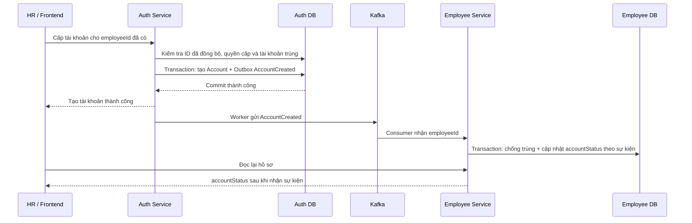

# Hướng dẫn giao tiếp giữa các service HRM

## 1. Thiết kế đã chọn

**Tạo Employee độc lập. Khi cần, HR cấp Account tại Auth bằng `employeeId`. Sau khi tạo thành công, Auth phát sự kiện để Employee cập nhật `accountStatus` theo trạng thái do Auth cung cấp.**

Employee không lưu `accountId`, không điều phối việc tạo tài khoản và không cần lưu trạng thái yêu cầu cấp tài khoản. Auth sở hữu Account và giữ liên kết `employeeId`.

Không cần thêm service nghiệp vụ. Kafka là hạ tầng riêng; worker và consumer chạy trong từng ứng dụng Spring Boot. Hai service không phải chạy cùng lúc để trao đổi sự kiện, miễn dữ liệu còn được lưu và bên nhận hoạt động lại.

## 2. Phần đã có và phần cần triển khai

| Thành phần | Trạng thái |
|---|---|
| `Employee.accountStatus`, cột `account_status` | Đã bổ sung enum, mặc định `NOT_CREATED` cho nhân viên mới, không nullable |
| `accountStatus` trong response tạo, sửa, đọc và danh sách nhân viên | Đã bổ sung |
| `accountStatus` trong request tạo/sửa | Không cho client điều khiển; backend quản lý |
| Script cập nhật database cũ | Có tại `employee-service/src/main/resources/static/sql/003_replace_has_account_with_account_status.sql`; cần chạy thủ công trước khi khởi động bản mới |
| Kafka, Outbox, consumer và cập nhật tự động từ Auth | Chưa triển khai |
| Danh sách ID nhân viên hợp lệ tại Auth | Chưa triển khai |
| Đồng bộ tài khoản đã tồn tại | Cần triển khai đối soát ban đầu |

Thêm trường dữ liệu chưa làm nó tự cập nhật khi Auth tạo Account. Các flow bên dưới là thiết kế cho phần tích hợp tiếp theo.

## 3. Quyền sở hữu dữ liệu

| Service | Dữ liệu sở hữu | Dữ liệu tham chiếu |
|---|---|---|
| Employee | Hồ sơ, phòng ban, chức danh, trạng thái làm việc | `accountStatus`: bản sao trạng thái tài khoản tại Auth |
| Auth | Account, mật khẩu, role, token, phiên đăng nhập | `employeeId`: nhân viên liên kết với Account |

Mỗi service sở hữu database/schema và quyền truy cập riêng. Không đọc/ghi trực tiếp bảng của service khác, không có foreign key xuyên database.

`accountStatus` chỉ phục vụ hiển thị, không dùng làm căn cứ phân quyền hoặc cho phép đăng nhập. Auth vẫn là nguồn dữ liệu chính về tài khoản.

## 4. Tạo nhân viên

```text
HR → Employee Service → lưu Employee với accountStatus = NOT_CREATED → hoàn tất
```

Tạo Employee không tạo Account và không chờ Auth.

Để Auth xác minh nhân viên mà không gọi API Employee lúc cấp tài khoản, triển khai thêm:

1. Employee lưu hồ sơ và Outbox chứa `EmployeeCreated` trong cùng transaction.
2. Worker gửi sự kiện đã commit lên Kafka.
3. Auth nhận và lưu bản sao tối thiểu của thông tin nhân viên, ví dụ `employeeId` và trạng thái hợp lệ.
4. Bước này chưa tạo Account.

Nếu sự kiện chưa đến, Auth chưa thể xác minh ID. Trả lỗi có thể thử lại, không khẳng định chắc chắn nhân viên không tồn tại. Nếu tính hợp lệ phụ thuộc trạng thái làm việc, cần nhận thêm sự kiện thay đổi trạng thái; bản sao vẫn có độ trễ.

## 5. Cấp tài khoản khi cần



Auth kiểm tra quyền người cấp, dữ liệu và role được phép gán. Auth duy trì ràng buộc duy nhất cho `employeeId` và email theo chính sách tài khoản. Cách thiết lập mật khẩu do Auth quản lý; không gửi mật khẩu hoặc token kích hoạt qua sự kiện.

Nếu tạo Account thất bại, Auth trả lỗi cho người gọi; Employee vẫn tồn tại, không cần nhận `AccountCreationFailed` để theo dõi một yêu cầu mà nó không sở hữu.

Nếu Auth đã commit nhưng HTTP response bị mất, người gọi cần tra cứu/thử lại an toàn. Ràng buộc duy nhất và cơ chế chống trùng yêu cầu phải tránh tạo hai Account.

## 6. Ý nghĩa của accountStatus

| Giá trị | Ý nghĩa |
|---|---|
| `UNKNOWN` | Chưa xác minh trạng thái; dữ liệu cũ chờ đối soát từ Auth |
| `NOT_CREATED` | Nhân viên mới chưa được cấp tài khoản theo thông tin hiện biết |
| `PENDING_ACTIVATION` | Đã có tài khoản, chờ kích hoạt |
| `ACTIVE` | Tài khoản đang hoạt động |
| `DISABLED` | Tài khoản bị vô hiệu hóa |

Chỉ lưu enum, không lưu thêm boolean `hasAccount` hoặc `accountId`. Không gộp
`PENDING`/`FAILED` của yêu cầu cấp tài khoản vào trạng thái hoạt động của Account.

Auth hiện có `User.active`: tài khoản tồn tại với `active = true` ánh xạ sang
`ACTIVE`, `active = false` ánh xạ sang `DISABLED`. `PENDING_ACTIVATION` dành cho
luồng kích hoạt nếu bổ sung sau này; không thể phân biệt trạng thái này chỉ bằng
boolean `active` hiện tại.

Tạo Account thất bại không đổi trạng thái tại Employee. Frontend có thể báo thành
công từ phản hồi Auth trước khi Employee nhận sự kiện. Không dùng `NOT_CREATED`
để bỏ qua kiểm tra trùng tại Auth. `UNKNOWN` cũng không khẳng định chưa có tài khoản.

Auth phát `AccountCreated` và `AccountStatusChanged` với trạng thái mới. Nếu cho
phép xóa/gỡ liên kết Account, phát trạng thái `NOT_CREATED`. Khi tích hợp consumer,
phải bổ sung phiên bản tăng dần theo liên kết nhân viên và lưu phiên bản cuối đã
xử lý tại Employee, có thể trong bảng metadata riêng. Chỉ áp dụng phiên bản mới
hơn để tránh sự kiện tạo cũ ghi đè trạng thái vô hiệu hóa/xóa mới. Không suy ra
thứ tự chỉ từ thời gian gửi. Các phần này chưa được triển khai trong code.

Migration `003` thêm cột trạng thái cho database cũ, khởi tạo các bản ghi cũ thành
`UNKNOWN` và bỏ cột `has_account`. Cả `true` và `false` cũ đều không xác định được
trạng thái hoạt động thực tế. Cần đối soát từ Auth. Nhân viên được tạo sau migration
mặc định `NOT_CREATED`. Script chạy được khi chưa chạy `002`; không chạy `002` sau
`003`. Với database mới, dùng schema khởi tạo hiện tại.

## 7. Hợp đồng AccountCreated

Payload đề xuất cho Employee gồm ID nhân viên, trạng thái và phiên bản liên kết, không cần `accountId`:

```json
{
  "eventId": "da98033a-72d8-4792-8ba2-e498b5a814fb",
  "eventType": "AccountCreated",
  "schemaVersion": 1,
  "occurredAt": "2026-09-24T03:00:00Z",
  "producer": "auth-service",
  "correlationId": "90c92fe5-9adc-4d35-ac24-3c5ad52c7701",
  "data": {
    "employeeId": "d38e31b7-0bba-420c-8eaf-50edbe5a61ae",
    "accountStatus": "ACTIVE",
    "accountVersion": 1
  }
}
```

- `eventId` giữ nguyên khi retry gửi, dùng chống xử lý trùng.
- `correlationId` liên kết log toàn bộ quá trình.
- `schemaVersion` xác định cấu trúc payload.
- `accountVersion` tăng dần theo liên kết của nhân viên, kể cả khi xóa/tạo lại Account; khác với phiên bản cấu trúc payload.
- `AccountStatusChanged` dùng cùng cấu trúc `data`, ví dụ `DISABLED` khi Auth vô hiệu hóa tài khoản.
- Dùng `employeeId` làm Kafka message key. Không giả định thứ tự toàn cục giữa topic hoặc qua các luồng retry.
- Chỉ nguồn nội bộ được cấp quyền mới được phát sự kiện này; trường `producer` trong JSON không thay thế xác thực và ACL.
- Không gửi mật khẩu, private key, token hoặc toàn bộ hồ sơ nhân sự.

## 8. Outbox, retry và chống trùng

Service phát sự kiện từ thay đổi database lưu Outbox trong cùng transaction với dữ liệu nghiệp vụ. Worker đọc bản ghi đã commit và chỉ đánh dấu đã gửi sau khi Kafka xác nhận. Nhiều worker cần cơ chế claim/lease và retry có khoảng chờ.

Có thể gửi trùng nếu worker chết sau khi Kafka nhận nhưng trước khi đánh dấu Outbox. Consumer phải chịu được việc nhận lại:

- Lưu `eventId` đã xử lý với ràng buộc duy nhất theo consumer.
- Cập nhật Employee và dấu xử lý trong cùng transaction.
- Chỉ xác nhận message/commit offset sau khi transaction thành công.
- Áp dụng trạng thái theo `accountVersion` để loại bỏ cập nhật cũ. Auth vẫn phải chống trùng riêng khi tạo Account.

| Lỗi | Cách xử lý |
|---|---|
| Transaction tạo Account thất bại | Rollback Account và Outbox; không gửi AccountCreated |
| Kafka không sẵn sàng | Outbox giữ sự kiện, worker retry |
| Employee tạm dừng | Kafka giữ message theo retention, consumer tiếp tục khi chạy lại |
| Employee gặp lỗi database | Rollback và retry |
| Không tìm thấy Employee khi nhận sự kiện | Không tự tạo hồ sơ rỗng; retry có giới hạn, cảnh báo và đối soát |
| Payload sai hoặc lỗi vượt ngưỡng | Dead-letter topic, cảnh báo và quy trình sửa/chạy lại |
| Trạng thái sai do thiếu sự kiện hoặc dữ liệu cũ | Đối soát từ Auth qua API/snapshot/sự kiện được kiểm soát |

Cấu hình retention, độ bền lưu trữ và thời gian giữ dấu chống trùng phù hợp với downtime và nhu cầu chạy lại. Không coi transaction Kafka là transaction chung với database của các service.

## 9. Mở rộng sang service khác

Có thể dùng chung một cụm Kafka. Topic đề xuất:

| Topic | Producer | Consumer |
|---|---|---|
| `hrm.employee.lifecycle.v1` | Employee | Auth và các phân hệ cần theo dõi nhân viên |
| `hrm.auth.account-lifecycle.v1` | Auth | Employee và các bên được phép nhận thông tin tài khoản |

Mỗi bên cần nhận đủ sự kiện có consumer group riêng; các instance của cùng nhóm xử lý dùng chung group để chia tải. Thêm service không bắt buộc Employee gọi service đó hoặc chờ kết quả.

Ví dụ `EmployeeTerminated` có thể được Auth nhận để khóa tài khoản, Leave xử lý phép và Payroll xử lý kỳ lương cuối. Khóa tài khoản vẫn có độ trễ và không tự thu hồi ngay JWT đã cấp.

REST tiếp tục phục vụ thao tác cần phản hồi ngay, như tạo hồ sơ, cấp Account và đọc danh sách. Chỉ thêm workflow/Saga khi có quy trình nhiều bước cần thứ tự, timeout hoặc bù trừ rõ ràng.

## 10. Thứ tự triển khai tiếp

1. Chạy script thêm cột cho database cũ. Employee đã xác minh JWT từ Auth bằng public key; tiếp tục bổ sung phân quyền theo thao tác/phạm vi dữ liệu và cơ chế kiểm tra/thu hồi trạng thái khi đồng bộ sẵn sàng.
2. Chốt hợp đồng sự kiện, chính sách nhân viên được cấp tài khoản và yêu cầu về độ trễ.
3. Triển khai Kafka, Outbox Employee và consumer Auth để đồng bộ ID nhân viên; nạp dữ liệu ban đầu cho nhân viên đã tồn tại.
4. Triển khai Outbox Auth và consumer Employee cho `AccountCreated` / `AccountStatusChanged`, kèm kiểm soát phiên bản.
5. Đối soát tài khoản đã tồn tại để cập nhật `accountStatus`; không mặc định tất cả dữ liệu cũ chưa có Account.
6. Giám sát Outbox tồn đọng, consumer lag, dead-letter topic và log theo `correlationId`.
7. Kiểm chứng rollback, downtime, gửi trùng, ID chưa đồng bộ, tài khoản trùng, crash sau commit và phục hồi/đối soát.
