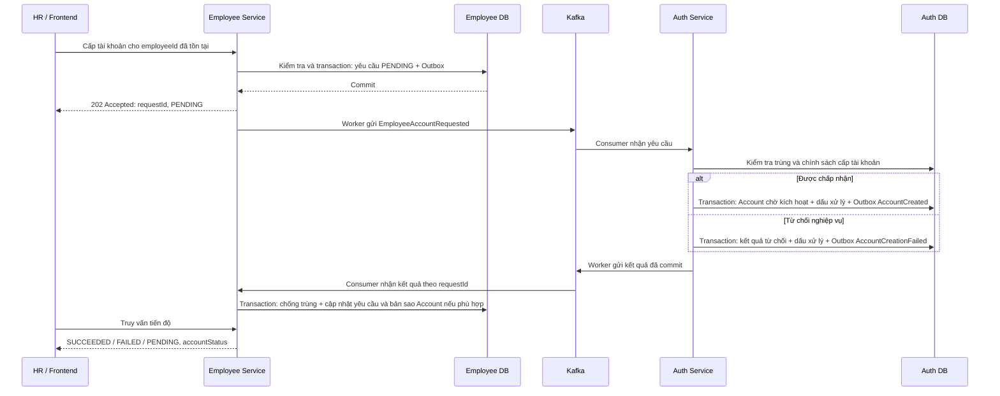

# Hướng dẫn giao tiếp giữa các service HRM

## 1. Thiết kế đã chọn

**Employee là nguồn dữ liệu chính về nhân viên. Khi người dùng muốn cấp tài khoản,
Employee xác minh nhân viên và gửi `EmployeeAccountRequested` qua Kafka. Auth tạo
Account gắn với `employeeId`, rồi gửi kết quả về Employee.**

```text
Tạo hồ sơ: UI → Employee → lưu Employee → trả employeeId
Cấp tài khoản: UI → Employee → Outbox → EmployeeAccountRequested → Kafka → Auth
Kết quả: Auth → Outbox → AccountCreated / AccountCreationFailed → Kafka → Employee → UI
```

Tạo nhân viên và yêu cầu cấp tài khoản là hai thao tác riêng. Không chọn cấp tài
khoản thì không gửi yêu cầu sang Auth. Employee không lưu `accountId`, nhưng sở hữu
trạng thái yêu cầu cấp tài khoản. Auth sở hữu Account và liên kết `employeeId`.

Không cần thêm service nghiệp vụ. Worker và consumer chạy trong từng ứng dụng.
Hai service không cần hoạt động cùng lúc để trao đổi message, miễn dữ liệu còn
được lưu và bên nhận hoạt động lại. Không giữ HTTP request mở để chờ Auth xử lý.

Lộ trình triển khai nằm ở [mục 10](#10-lộ-trình-triển-khai-theo-phase). Đây là thiết
kế đích; mục 2 phân biệt với code đã có.

## 2. Phần đã có và phần cần triển khai

| Thành phần | Trạng thái |
|---|---|
| `Employee.accountStatus` và response tương ứng | Đã có enum; nhân viên mới mặc định `NOT_CREATED`; client không được sửa qua API hồ sơ |
| Schema Employee | `employee-service/docs/sql/001_employee_schema.sql` đầy đủ; database cũ cần đối chiếu và migration riêng |
| Kafka local và cấu hình hai service | Đã bổ sung topic yêu cầu/kết quả, group và smoke test; xem [hướng dẫn](infra/kafka/README.md) |
| API yêu cầu cấp tài khoản, bảng yêu cầu, `EmployeeAccountRequested` | Đã triển khai; bật bằng `HRM_EVENTS_ENABLED=true` sau schema đầy đủ của Auth/Employee và Kafka topics |
| Outbox hai phía, claim/lease, producer/consumer, chống trùng và kết quả | Đã triển khai cho cấp tài khoản và nhận trạng thái sau kích hoạt; chưa có DLT/đối soát |
| Auth tạo tài khoản chờ kích hoạt | Đã có `activation_pending=true`, `is_active=false`, role `EMPLOYEE`; đã có email Resend, token một lần/hết hạn và API kích hoạt |
| Đồng bộ trạng thái và đối soát tài khoản cũ | Đã nhận `AccountStatusChanged` sau kích hoạt; đối soát tài khoản cũ chưa triển khai |

Flow này không cần `employee_references` tại Auth hoặc lỗi `EMPLOYEE_NOT_SYNCED`.
`EmployeeCreated` có thể phục vụ sự kiện vòng đời cho phân hệ khác sau này; không
là điều kiện tiên quyết cho yêu cầu cấp tài khoản. Xem [cách chạy flow đã có](infra/kafka/ACCOUNT-PROVISIONING.md).
Luồng mới mặc định tắt; Auth cần `docs/sql/001_auth_schema.sql`, Employee cần
`docs/sql/001_employee_schema.sql` trong thư mục từng service ngay cả khi chưa bật sự kiện. Khi bật ở Auth, `/register` cũ trả `409` để không bỏ qua Outbox.
Phạm vi quyền API mới hiện là HR/ADMIN toàn hệ thống, chưa chia theo phòng ban/tenant.

## 3. Quyền sở hữu dữ liệu

| Thành phần | Trách nhiệm |
|---|---|
| Employee | Hồ sơ, phòng ban, chức danh, `EmployeeStatus`; xác minh nhân viên, quyền yêu cầu cấp tài khoản; lưu và theo dõi yêu cầu |
| Auth | Account, mật khẩu, role, token; kiểm tra chính sách cấp tài khoản và quyết định kết quả; giữ `employeeId` |
| Kafka | Lưu và phân phối yêu cầu/kết quả |
| Frontend | Tạo hồ sơ, gửi yêu cầu cấp tài khoản, truy vấn tiến độ tại Employee |

Mỗi service sở hữu database/schema riêng, không đọc/ghi bảng của service khác và
không tạo foreign key xuyên database. `accountStatus` tại Employee là bản sao để
hiển thị, không là nguồn quyết định quyền truy cập. `EmployeeStatus` mô tả việc làm
và không được cập nhật bằng kết quả cấp tài khoản từ Auth.

## 4. Tạo nhân viên và yêu cầu cấp tài khoản

1. UI tạo nhân viên tại Employee, nhận `201 Created` cùng `employeeId` sau commit.
2. Khi HR/ADMIN chọn cấp tài khoản, UI gửi yêu cầu riêng tới Employee bằng ID đó.
3. Employee kiểm tra quyền/phạm vi dữ liệu, nhân viên tồn tại, email đăng nhập và
   dữ liệu yêu cầu. Không tin `employeeId`, role hoặc danh tính người yêu cầu chỉ
   vì client gửi lên. MVP cấp role `EMPLOYEE`; cấp quyền cao hơn cần luồng có phân quyền riêng.
4. Trong một transaction, lưu yêu cầu `PENDING` và Outbox chứa
   `EmployeeAccountRequested`. Chỉ trả `202 Accepted` sau commit, kèm `requestId`.
5. Worker đọc Outbox đã commit, gọi `AccountProvisioningProducer` gửi lên Kafka.
   Chỉ đánh dấu đã gửi khi broker xác nhận; lỗi gửi được retry từ Outbox.

API đã triển khai, cần bật cờ sự kiện sau khi tạo schema và Kafka topics:

| API tại Employee | Mục đích |
|---|---|
| `POST /api/v1/employees/{employeeId}/account-requests` | Ghi nhận yêu cầu; body gồm email đăng nhập, không có mật khẩu; trả `202` và `requestId`, `provisioningStatus=PENDING` |
| `GET /api/v1/employees/{employeeId}/account-requests/{requestId}` | Trả tiến độ và mã lỗi nghiệp vụ nếu có; kiểm tra quyền xem |

POST dùng `Idempotency-Key` để lần gửi lại do mất HTTP response trả cùng yêu cầu;
unique key phải được ràng buộc trong database theo phạm vi người gọi. Cùng key
nhưng payload khác trả `409`. Chỉ cho phép một yêu cầu đang chờ trên một nhân viên,
kiểm soát nguyên tử trong database. Sau thất bại nghiệp vụ, sửa dữ liệu và tạo yêu
cầu mới với key/`requestId` mới. Không tạo hàng loạt yêu cầu mới khi chưa rõ kết quả cũ.

## 5. Auth xử lý và trả kết quả


```mermaid
sequenceDiagram
    participant UI as HR / Frontend
    participant E as Employee Service
    participant ED as Employee DB
    participant K as Kafka
    participant A as Auth Service
    participant AD as Auth DB

    UI->>E: Cấp tài khoản cho employeeId đã tồn tại
    E->>ED: Kiểm tra và transaction: yêu cầu PENDING + Outbox
    ED-->>E: Commit
    E-->>UI: 202 Accepted: requestId, PENDING
    E->>K: Worker gửi EmployeeAccountRequested
    K->>A: Consumer nhận yêu cầu
    A->>AD: Kiểm tra trùng và chính sách cấp tài khoản
    alt Được chấp nhận
        A->>AD: Transaction: Account chờ kích hoạt + dấu xử lý + Outbox AccountCreated
    else Từ chối nghiệp vụ
        A->>AD: Transaction: kết quả từ chối + dấu xử lý + Outbox AccountCreationFailed
    end
    A->>K: Worker gửi kết quả đã commit
    K->>E: Consumer nhận kết quả theo requestId
    E->>ED: Transaction: chống trùng + cập nhật yêu cầu và bản sao Account nếu phù hợp
    UI->>E: Truy vấn tiến độ
    E-->>UI: SUCCEEDED / FAILED / PENDING, accountStatus
```

Auth tin việc Employee đã xác minh ID khi yêu cầu đến từ producer được xác thực,
đúng topic và ACL. Trường `producer` trong JSON không phải bằng chứng xác thực.
Auth không gọi lại Employee hoặc đợi một `EmployeeCreated` chỉ để kiểm tra ID.
Sự xác minh này phản ánh thời điểm yêu cầu được chấp nhận; không bảo đảm trạng thái
lao động không thay đổi trong lúc message chờ. Quy tắc nghỉ việc/hủy yêu cầu cần
luồng vòng đời riêng khi mở rộng.

Auth vẫn kiểm tra schema, email, role theo chính sách và các ràng buộc unique cho
`employeeId`/email. Consumer gọi service nghiệp vụ nội bộ, không gọi vòng lại API
`/register` hoặc bỏ qua phân quyền của API đó. Không có JWT người dùng trong Kafka;
Employee kiểm tra quyền tại thời điểm nhận yêu cầu, Auth áp dụng chính sách cấp
role phía mình. `requestedBy` chỉ dùng audit, không tự cấp quyền dựa trên giá trị đó.

Không gửi mật khẩu, hash mật khẩu hoặc token kích hoạt qua Kafka. Thiết kế đích
là Auth tạo Account chờ kích hoạt, quản lý việc gửi lời mời và thiết lập mật khẩu
qua kênh riêng. Đã bổ sung `activation_pending` và chặn đăng nhập trước kích hoạt.
Đã có API thiết lập mật khẩu, token một lần/hết hạn và mail outbox gửi qua Resend.
Xem [cấu hình và API kích hoạt](auth-service-main/docs/ACCOUNT-ACTIVATION.md).
`activation_pending=true` phân biệt tài khoản chờ kích hoạt với tài khoản bị khóa. Không dùng mật khẩu mặc định chung để lấp phần còn thiếu.

Khi `hrm.events.enabled=true` tại Auth, `/api/v1/auth/register` trả `409`, hướng
người gọi sang Employee. Khi cờ tắt, API cũ vẫn nhận mật khẩu và tạo tài khoản active;
không phát sự kiện. UI của flow mới chỉ gửi yêu cầu tại Employee.

## 6. Trạng thái yêu cầu và trạng thái tài khoản

### 6.1. Trạng thái yêu cầu cấp tài khoản

Lưu trong bảng yêu cầu riêng ở Employee, không thêm vào enum `AccountStatus`.

| Trạng thái | Ý nghĩa |
|---|---|
| `NOT_REQUESTED` | UI chưa có yêu cầu; không cần tạo bản ghi yêu cầu giả |
| `PENDING` | Đã ghi nhận, chưa có kết quả cuối |
| `SUCCEEDED` | Auth đã tạo Account; chưa đồng nghĩa đã kích hoạt |
| `FAILED` | Auth từ chối do nghiệp vụ, có `errorCode` |

Kết quả đối chiếu cả `requestId` và `employeeId`; cập nhật đúng bản ghi yêu cầu.
Kết quả cũ không được ghi đè trạng thái của lần yêu cầu mới. `PENDING` quá lâu cần
cảnh báo/đối soát, không tự kết luận chưa có Account hoặc chuyển thành `FAILED` chỉ
vì timeout. Tạo Account thất bại không xóa Employee.

### 6.2. Bản sao accountStatus

| Giá trị | Ý nghĩa |
|---|---|
| `NOT_CREATED` | Chưa có tài khoản theo thông tin hiện biết |
| `PENDING_ACTIVATION` | Đã có tài khoản, chờ thiết lập mật khẩu/kích hoạt |
| `ACTIVE` | Tài khoản đang hoạt động |
| `DISABLED` | Tài khoản bị vô hiệu hóa |

Không lưu thêm `hasAccount` hoặc `accountId`. Khi nhận `AccountCreated`, yêu cầu
chuyển `SUCCEEDED`, còn `accountStatus` lấy từ payload của Auth (flow mới dự kiến
`PENDING_ACTIVATION`). `AccountCreationFailed` chỉ cập nhật yêu cầu, không đặt lại
`accountStatus`: lỗi trùng có thể xảy ra vì Account đã tồn tại.

Auth phát `AccountStatusChanged` khi kích hoạt/khóa/mở tài khoản; nếu hỗ trợ xóa,
phát trạng thái `NOT_CREATED`. Cần `accountVersion` tăng dần theo liên kết nhân viên,
lưu cả khi xóa/tạo lại Account. Employee chỉ áp dụng bản sao có version mới hơn.
Hoàn tất yêu cầu dựa trên `requestId` độc lập với việc áp dụng bản sao: kết quả tạo
đến muộn vẫn có thể hoàn tất đúng yêu cầu, nhưng không được ghi đè trạng thái khóa
có version cao hơn đã nhận trước đó.

Auth đã có `User.activationPending`: true ứng với `PENDING_ACTIVATION` và bắt buộc
inactive. Với tài khoản không chờ kích hoạt, `User.active` true/false ứng với
`ACTIVE`/`DISABLED`. API hoàn tất kích hoạt đã có. Trong development, dùng mặc định `NOT_CREATED`, không
có trạng thái `UNKNOWN`. Schema Employee đầy đủ không dùng `has_account`;
script chỉ tạo bảng/index còn thiếu, không tự chuyển đổi cột hay trạng thái cũ.
Database cũ cần đối chiếu và migration riêng trước khi chạy phiên bản hiện tại.

## 7. Hợp đồng sự kiện

### 7.1. EmployeeAccountRequested

Đây là message yêu cầu cấp tài khoản. Payload đề xuất cho MVP:

```json
{
  "eventId": "f749ce13-a512-47d1-a0d7-52e9fc40709b",
  "eventType": "EmployeeAccountRequested",
  "schemaVersion": 1,
  "occurredAt": "2026-09-25T03:00:00Z",
  "producer": "employee-service",
  "correlationId": "90c92fe5-9adc-4d35-ac24-3c5ad52c7701",
  "requestId": "ad96c1d8-d0d9-477c-a47b-7aed14d46db1",
  "data": {
    "employeeId": "d38e31b7-0bba-420c-8eaf-50edbe5a61ae",
    "email": "employee@example.com",
    "requestedBy": "42"
  }
}
```

`requestedBy` lấy từ principal đã xác thực ở Employee. Email là email đăng nhập
được xác nhận trong yêu cầu, có thể khác email liên hệ của hồ sơ. Không gửi toàn
bộ Employee. MVP không nhận role tùy ý; Auth tự gán `EMPLOYEE` theo chính sách đã chốt.

### 7.2. AccountCreated

```json
{
  "eventId": "da98033a-72d8-4792-8ba2-e498b5a814fb",
  "eventType": "AccountCreated",
  "schemaVersion": 1,
  "occurredAt": "2026-09-25T03:00:01Z",
  "producer": "auth-service",
  "correlationId": "90c92fe5-9adc-4d35-ac24-3c5ad52c7701",
  "requestId": "ad96c1d8-d0d9-477c-a47b-7aed14d46db1",
  "data": {
    "employeeId": "d38e31b7-0bba-420c-8eaf-50edbe5a61ae",
    "accountStatus": "PENDING_ACTIVATION",
    "accountVersion": 1
  }
}
```

### 7.3. AccountCreationFailed

```json
{
  "eventId": "95f37f52-9d72-4dd6-83bc-e996216344cd",
  "eventType": "AccountCreationFailed",
  "schemaVersion": 1,
  "occurredAt": "2026-09-25T03:00:01Z",
  "producer": "auth-service",
  "correlationId": "90c92fe5-9adc-4d35-ac24-3c5ad52c7701",
  "requestId": "ad96c1d8-d0d9-477c-a47b-7aed14d46db1",
  "data": {
    "employeeId": "d38e31b7-0bba-420c-8eaf-50edbe5a61ae",
    "errorCode": "EMAIL_ALREADY_USED"
  }
}
```

Quy ước:

- `eventId`: chống trùng message; retry vận chuyển giữ nguyên ID và payload.
- `requestId`: chống thực thi trùng yêu cầu; kết quả giữ nguyên ID của yêu cầu.
- `correlationId`: nối log hai chiều; kết quả có `eventId` mới, cùng correlation/request/employee ID.
- `schemaVersion` là phiên bản cấu trúc; `accountVersion` là phiên bản dữ liệu do Auth sở hữu.
- Mã lỗi nghiệp vụ ổn định: `ACCOUNT_ALREADY_EXISTS`, `EMAIL_ALREADY_USED`; không phát
  `EMPLOYEE_NOT_SYNCED` vì không còn bước đợi đồng bộ ID. Lỗi hạ tầng được retry.
- Key Kafka là `employeeId`. Không giả định có thứ tự toàn cục giữa topic hoặc qua retry.
- `AccountStatusChanged` dùng payload trạng thái/version như `AccountCreated`, có
  `eventId`/`correlationId` riêng; không bắt buộc `requestId` của lần cấp cũ và không
  dùng nó để chuyển trạng thái yêu cầu cấp tài khoản.

## 8. Outbox, retry và chống trùng

Employee lưu yêu cầu + Outbox trong cùng transaction. Auth lưu Account, kết quả
xử lý và Outbox kết quả trong cùng transaction. Với từ chối nghiệp vụ, lưu kết quả
thất bại + Outbox mà không tạo Account. Unique constraint có thể làm transaction
bị rollback; phải xử lý xung đột và ghi kết quả trong transaction hợp lệ, không
bắt lỗi rồi tiếp tục ghi trên transaction đã bị đánh dấu rollback.

Worker đọc bản ghi đã commit, gửi theo lô, dùng claim/lease khi chạy nhiều instance,
retry có backoff và chỉ đánh dấu đã gửi sau broker ack. Crash sau ack nhưng trước
đánh dấu có thể gửi trùng; producer idempotence không thay thế consumer chống trùng.

- Consumer lưu unique `(consumer_name, event_id)` cùng transaction với nghiệp vụ.
- Auth còn lưu unique `requestId`, payload/kết quả tương ứng và unique employee/email.
  Cùng yêu cầu được giao lại thì không tạo Account mới hoặc đổi kết quả thành lỗi
  trùng; dùng kết quả đã lưu và Outbox để hoàn tất giao nhận.
- Yêu cầu mới cho nhân viên đã có Account trả `ACCOUNT_ALREADY_EXISTS`; không tự
  gắn lại email/tài khoản hoặc kích hoạt tài khoản đang bị khóa. Có đối soát riêng.
- Employee đối chiếu request/employee, kiểm soát cập nhật phiên bản nguyên tử và
  chỉ commit offset sau transaction database thành công.

| Tình huống | Xử lý |
|---|---|
| Employee không tồn tại/không đủ quyền | Từ chối tại Employee trước khi ghi yêu cầu/Outbox |
| Transaction ghi yêu cầu thất bại | Rollback yêu cầu và Outbox; hồ sơ đã tạo trước đó vẫn giữ nguyên |
| Kafka hoặc Auth tạm dừng | Outbox/message chờ xử lý; yêu cầu vẫn `PENDING` |
| Auth lỗi database tạm thời | Rollback và retry, không phát lỗi nghiệp vụ giả |
| Auth từ chối email/tài khoản trùng | Phát `AccountCreationFailed`; chỉ yêu cầu chuyển `FAILED` |
| Account đã tạo nhưng kết quả chưa đến | Outbox Auth tiếp tục gửi; theo dõi và đối soát |
| Kết quả không khớp request/employee | Không cập nhật nhầm hồ sơ; đưa vào quy trình kiểm tra/retry/DLT |
| Payload lỗi hoặc retry vượt ngưỡng | DLT, cảnh báo, sửa/chạy lại; chỉ ack gốc khi chuyển DLT thành công |

Chốt retention Kafka, Outbox và dấu chống trùng theo downtime/replay. Không xóa dấu
chống trùng trong khi còn khả năng chạy lại message liên quan. Kafka không giữ dữ
liệu vô hạn và không tạo transaction nguyên tử chung với database hai service.

## 9. Topic và mở rộng service

Topic/group đã cấu hình cho luồng mới (đã có listener trạng thái sau kích hoạt):

| Topic | Message | Producer | Consumer group |
|---|---|---|---|
| `hrm.employee.account-requests.v1` | `EmployeeAccountRequested` | Employee | Auth: `auth-account-requests-v1` |
| `hrm.auth.account-results.v1` | `AccountCreated`, `AccountCreationFailed` | Auth | Employee: `employee-account-results-v1` |
| `hrm.auth.account-lifecycle.v1` | `AccountStatusChanged`, snapshot khi mở rộng | Auth | Employee: `employee-account-lifecycle-v1` |

Compose đã tạo hai topic yêu cầu/kết quả, giữ `hrm.employee.lifecycle.v1`,
`hrm.auth.account-lifecycle.v1` để mở rộng và `hrm.local.smoke.v1` để thử kết nối.
Consumer hiện chỉ nghe topic yêu cầu/kết quả. `KafkaConnectionTests` kiểm tra topic
mới; xem [Kafka README](infra/kafka/README.md).

Payroll/Leave có thể nghe `EmployeeCreated`/`EmployeeTerminated` qua topic vòng đời
sau này, không nghe yêu cầu cấp tài khoản. Mỗi bên cần nhận đủ message có consumer
group riêng; instance của cùng bên dùng chung group để chia tải. Khi Employee cần
nhận kết quả và vòng đời tài khoản, cấu hình group riêng theo listener, không ép
hai loại xử lý vào một group mặc định duy nhất.

REST dùng để tạo hồ sơ, ghi nhận yêu cầu và đọc tiến độ. Chỉ thêm Saga/workflow
khi có quy trình nhiều bước, thứ tự, timeout và bù trừ cần quản lý rõ ràng. Sự kiện
khóa Account có độ trễ; JWT đã cấp có thể còn hiệu lực, cần thiết kế thu hồi riêng
nếu yêu cầu chặn quyền ngay.

## 10. Lộ trình triển khai theo phase

Outbox và chống trùng được triển khai từ lần đầu giao tiếp nghiệp vụ. Hạ tầng local
và luồng cấp tài khoản chờ kích hoạt đã có. Đã có kích hoạt tối thiểu; cần hoàn tất các phần
phục hồi/đối soát còn thiếu trước khi tuyên bố hoàn thành MVP hoặc production. MVP hoàn thành ở phase 3; production cần
các tiêu chí phase 4–6.

| Phase | Mục tiêu | Kết quả kiểm chứng |
|---|---|---|
| 0 | Chốt hợp đồng và chuẩn bị service | API yêu cầu, quyền, lỗi, trạng thái và thiết lập mật khẩu rõ ràng |
| 1 | Hạ tầng local | Topic/group đúng flow mới, hai service kết nối được |
| 2 | Employee gửi yêu cầu | Hồ sơ độc lập; yêu cầu + Outbox cùng commit; worker gửi đúng Kafka |
| 3 | Auth xử lý và trả kết quả | Account chờ kích hoạt, Employee nhận thành công/thất bại, kích hoạt được |
| 4 | Phục hồi và dữ liệu cũ | Retry, sai thứ tự, khóa/mở, đối soát hoạt động |
| 5 | Staging | Kiểm chứng tải, bảo mật, transaction và phục hồi |
| 6 | Production | Rollout, giám sát, rollback và vận hành |

### Phase 0 — Chốt hợp đồng và chuẩn bị service

1. Chốt API mục 4, envelope mục 7, topic/group mục 9, unique và idempotency key.
   Không bổ sung `employee_references` hoặc điều kiện `EMPLOYEE_NOT_SYNCED` cho flow này.
2. Phân quyền tạo hồ sơ/yêu cầu tại tầng service Employee, kiểm tra phạm vi nhân
   viên được quản lý. Auth mặc định cấp `EMPLOYEE`; chốt luồng riêng để cấp quyền cao hơn.
3. Chuẩn bị mô hình tài khoản chờ kích hoạt, cách thiết lập mật khẩu và gửi lời mời
   do Auth sở hữu; thiết kế retry gửi lời mời riêng, tránh tạo lại Account.
4. Chốt kết quả `ACCOUNT_ALREADY_EXISTS`/`EMAIL_ALREADY_USED` và việc ghi nhận lỗi
   unique khi xử lý đồng thời. Hoàn thiện validation BCrypt theo byte cho các
   đường đặt mật khẩu; không chuyển thành lỗi 500 ngoài dự kiến.
5. Chốt kiểm soát `/register` cũ và migration tăng dần. Giữ `ddl-auto: validate`;
   không dùng script reset database để nâng cấp dữ liệu hiện có.

**Hoàn thành khi:** hợp đồng và quy tắc rõ ràng; test service xác nhận quyền, lỗi
đầu vào, phạm vi cấp role và thiết kế kích hoạt đã sẵn sàng để triển khai.

### Phase 1 — Dựng Kafka local

**Đã có:** [Compose, cấu hình Spring và smoke test](infra/kafka/README.md), topic
`hrm.employee.account-requests.v1`/`hrm.auth.account-results.v1`, group riêng cho hai
consumer. Vẫn giữ volume, healthcheck và topic smoke. Một broker local không là
cấu hình production.

### Phase 2 — Employee gửi yêu cầu cấp tài khoản

**Đã triển khai:** API, idempotency key, bảng yêu cầu, Outbox và worker gửi Kafka.

| Dữ liệu bổ sung tại Employee | Mục đích |
|---|---|
| `account_provisioning_requests` | requestId, employeeId, email, requestedBy, idempotency key/hash, trạng thái, lỗi, thời điểm |
| `outbox_events` | eventId, aggregateId, type, payload, trạng thái gửi, retry và claim/lease |

1. Giữ tạo Employee độc lập. Thêm API yêu cầu/truy vấn có phân quyền ở mục 4.
2. Lưu yêu cầu `PENDING` và Outbox `EmployeeAccountRequested` cùng transaction;
   kết quả HTTP `202` chỉ xác nhận đã tiếp nhận.
3. Worker gọi `AccountProvisioningProducer`, key là `employeeId`; chỉ đánh dấu
   Outbox sau broker ack. Retry giữ nguyên `eventId`, `requestId` và payload.
4. Chống yêu cầu đồng thời bằng ràng buộc database; mất response HTTP gửi lại cùng
   idempotency key trả cùng yêu cầu. Không phụ thuộc vào bản sao `accountStatus`
   để kết luận chắc chắn Auth chưa có Account.

**Hoàn thành khi:** không chọn cấp tài khoản thì không phát yêu cầu. ID không tồn
tại/không đủ quyền bị từ chối; rollback không để lại Outbox; Kafka tắt thì yêu cầu
vẫn được ghi `PENDING` và gửi lại khi broker phục hồi. Chưa có consumer Auth thì
chưa tuyên bố flow cấp tài khoản hoàn thành.

### Phase 3 — Auth tạo Account và Employee nhận kết quả

**Đã có phần cấp tài khoản:** Auth tạo Account chờ kích hoạt, ghi kết quả/Outbox;
Employee nhận và cập nhật yêu cầu/bản sao theo version. **Chưa hoàn thành phase:**
đã có luồng đặt mật khẩu/kích hoạt và cập nhật sau kích hoạt qua `AccountStatusChanged`.

| Service | Dữ liệu bổ sung |
|---|---|
| Auth | Kết quả theo requestId, `processed_events`, `outbox_events`, `account_link_versions`, trạng thái/kích hoạt tài khoản |
| Employee | `processed_events`, `last_account_version` để cập nhật bản sao |

1. Consumer Auth validate message rồi gọi service nghiệp vụ; tin xác minh ID của
   Employee qua nguồn nội bộ được kiểm soát. Không gọi lại Employee chỉ để xác minh ID.
2. Chống trùng event/request và ràng buộc unique employee/email. Lưu Account chờ
   kích hoạt + kết quả xử lý + Outbox `AccountCreated` cùng transaction; từ chối
   nghiệp vụ ghi `AccountCreationFailed`. Lỗi hạ tầng rollback/retry.
3. `account_link_versions` tăng nguyên tử theo employeeId, không xóa khi xóa Account.
   Kết quả chứa request/employee/correlation ID đúng yêu cầu; không cần accountId.
4. Consumer Employee hoàn tất đúng yêu cầu và cập nhật bản sao theo version trong
   cùng transaction với dấu chống trùng. Kết quả cũ không ghi đè yêu cầu mới hoặc
   trạng thái Account mới hơn. API sửa hồ sơ không được ghi đè cột trạng thái từ entity cũ.
5. Auth cung cấp luồng thiết lập mật khẩu/kích hoạt, sau đó phát
   `AccountStatusChanged` với version mới để Employee chuyển sang `ACTIVE`.
   Gửi lời mời có retry riêng; tài khoản chờ kích hoạt không đăng nhập được.
6. UI theo dõi tại Employee: `PENDING` → `SUCCEEDED`/`FAILED`; hiển thị trạng thái
   kích hoạt riêng. Chỉ báo Account đã tạo khi nhận kết quả Auth.

**Hoàn thành khi:** tạo hồ sơ → yêu cầu tại Employee → Auth tạo Account → Employee
hiển thị `SUCCEEDED`/`PENDING_ACTIVATION` → kích hoạt → `ACTIVE`. Luồng thất bại
trả lỗi rõ ràng; retry không tạo Account thứ hai; consumer khôi phục sau downtime
trong retention. Không tự xóa Employee khi tạo Account thất bại.

### Phase 4 — Phục hồi lỗi, trạng thái và dữ liệu đã tồn tại

**Phạm vi:** chuẩn bị hệ thống để chịu gián đoạn và nâng cấp từ dữ liệu hiện có.

1. Hoàn thiện claim/lease của worker cho nhiều instance, giới hạn batch, retry có
   backoff và thu hồi lease hết hạn. Không giữ transaction database dài trong lúc
   chờ mạng. Chỉ worker còn quyền claim mới đánh dấu bản ghi đã gửi.
2. Phân biệt lỗi tạm thời với payload không hợp lệ. Thêm dead-letter topic (DLT),
   thông tin lỗi và quy trình kiểm tra/chạy lại. Chỉ bỏ qua message ở topic gốc
   sau khi lưu chuyển sang DLT thành công; lỗi gửi DLT cũng phải được retry.
3. Khi replay cùng sự kiện, giữ `eventId`; consumer đã thành công sẽ bỏ qua. Nếu
   sửa payload để phát sự kiện thay thế, cấp `eventId` mới, giữ dấu liên hệ với
   sự kiện lỗi và tuân thủ phiên bản do service sở hữu dữ liệu quyết định.
4. Thêm thao tác khóa/mở Account có phân quyền tại Auth; cập nhật `is_active`, tăng
   phiên bản và ghi Outbox `AccountStatusChanged` cùng transaction. Không coi cập
   nhật SQL thủ công là đã phát sự kiện. Xác minh sự kiện `ACTIVE` cũ không ghi đè
   `DISABLED` mới.
5. Thêm job đối soát yêu cầu `PENDING` và tài khoản cũ. Auth tra cứu kết quả theo
   `requestId` và xuất `AccountSnapshot` có phiên bản từ database của mình qua kênh
   nội bộ được kiểm soát; Employee áp dụng bản sao. Không cần nạp toàn bộ ID nhân
   viên sang Auth trước khi cấp tài khoản; không đọc bảng xuyên service.
6. Với dữ liệu cũ chưa có version, khởi tạo version trong transaction tại nguồn.
   Snapshot đọc trạng thái/version nhất quán; nếu sự kiện mới đến trước snapshot
   cũ thì consumer bỏ qua snapshot cũ. Khi dữ liệu đích sai nhưng version bằng nhau,
   dùng quy trình sửa có kiểm soát từ nguồn với version mới, không mở quyền ghi đè
   tùy ý mọi message cùng version.
7. Đối soát cả nhân viên không có Account: chỉ đặt `NOT_CREATED` khi Auth xác nhận
   đã kiểm tra đầy đủ nhân viên đó bằng snapshot có phiên bản. Không suy ra việc
   chưa có Account chỉ từ việc chưa nhận sự kiện hoặc một trang kết quả bị thiếu.
8. Nếu mở rộng điều kiện cấp tài khoản theo trạng thái làm việc, kiểm tra tại
   Employee khi nhận yêu cầu và chốt cách xử lý khi nhân viên nghỉ việc lúc yêu cầu
   đang chờ. Bổ sung sự kiện vòng đời/hủy yêu cầu nếu cần; không giả định request
   cũ tự bị hủy hoặc Auth tự biết trạng thái nhân viên mới nhất.

**Hoàn thành khi:** đã kiểm chứng crash sau commit nhưng trước ack, message trùng/sai
thứ tự, broker hoặc consumer dừng, payload lỗi và replay. Dữ liệu seed/cũ được đối
soát; có báo cáo các ID không khớp và yêu cầu tồn đọng cần xử lý. Replay không tạo
thêm Account, mở lại Account bị khóa hoặc ghi đè kết quả của yêu cầu khác.

### Phase 5 — Kiểm chứng trên staging

**Phạm vi:** chứng minh các yêu cầu production bằng môi trường tương đương.

1. Dùng PostgreSQL và Kafka thật trong kiểm thử tích hợp tầng service. Chạy nhiều
   instance producer/consumer, kiểm chứng cạnh tranh worker và consumer rebalance.
   H2 hoặc mock không đủ để kết luận về khóa PostgreSQL hay mất kết nối Kafka.
2. Chốt tải dự kiến, độ trễ đồng bộ chấp nhận được, thời gian gián đoạn cần chịu và
   thời gian phục hồi; ghi giá trị đo được cùng điều kiện thử. Retention Kafka và
   thời gian giữ Outbox/dấu chống trùng phải phù hợp, không xóa dữ liệu còn cần replay.
3. Thêm metric và cảnh báo cho tuổi bản ghi Outbox chưa gửi, số lần retry, consumer
   lag, DLT, yêu cầu `PENDING` quá lâu và thời gian xử lý. Log có `eventId`,
   `requestId`, `correlationId`, `employeeId`, không có mật khẩu/token.
4. Hoàn thiện phân quyền API theo role và phạm vi dữ liệu tại các service. Các bộ
   đếm chống brute-force cần dùng chung khi Auth chạy nhiều instance; kiểm chứng
   việc nhận IP client đúng khi chạy sau reverse proxy đáng tin cậy.
5. Tách credential từng service, giới hạn quyền đọc/ghi topic và group bằng ACL,
   bật TLS/xác thực và bảo vệ khóa JWT. Kiểm chứng client không có quyền bị từ chối.
6. Chốt yêu cầu thu hồi quyền: JWT hợp lệ và bản sao `accountStatus` không bảo đảm
   khóa ngay. Nếu cần chặn ngay, thiết kế cơ chế kiểm tra/thu hồi riêng và đo độ trễ;
   nếu chấp nhận độ trễ thì ghi rõ giới hạn đó. Không dùng bản sao trạng thái để
   phân quyền khi chưa có chính sách về độ trễ và đối soát.
7. Thử nâng cấp schema/event tương thích ngược, rollback ứng dụng, backup/restore
   database và đối soát sau phục hồi. Không xóa topic/reset offset để chữa lỗi tùy tiện.

**Hoàn thành khi:** có kết quả kiểm chứng đáp ứng tải, độ trễ, phục hồi và bảo mật
đã chốt; người vận hành thực hiện được quy trình DLT, replay và đối soát. Còn các
tiêu chí này chưa đạt thì chưa chuyển sang production.

### Phase 6 — Rollout và vận hành production

**Phạm vi:** triển khai có kiểm soát, giữ khả năng phục hồi.

1. Chọn cụm Kafka hoặc dịch vụ quản lý đáp ứng yêu cầu sẵn sàng. Cấu hình tham khảo
   cho cụm đủ broker: replication factor 3, `min.insync.replicas=2`, producer
   `acks=all`; khi không đủ replica đồng bộ, chấp nhận tạm dừng ghi và giữ Outbox.
   Cần bố trí replica giữa các miền lỗi; cấu hình local một broker không đạt mục
   tiêu này. Đối chiếu [Apache Kafka broker configs](https://kafka.apache.org/38/configuration/broker-configs/).
2. Triển khai migration bổ sung tương thích với bản ứng dụng cũ; sau đó consumer
   hiểu hợp đồng mới, rồi producer/worker. Chuẩn bị topic/group và quyền truy cập,
   đối soát dữ liệu cũ; chỉ bật API yêu cầu mới khi cả hai chiều và luồng kích hoạt
   sẵn sàng. Kiểm soát đường `/register` cũ để không bỏ qua Outbox/chính sách mới.
3. Rollout theo nhóm instance hoặc phạm vi người dùng, kiểm tra lỗi API, Outbox,
   DLT và độ trễ cập nhật `accountStatus`; chỉ mở rộng khi đạt tiêu chí phase 5.
4. Khi cần rollback, dừng thành phần lỗi và giữ dữ liệu Outbox/topic/version để
   phục hồi. Bản rollback phải hiểu schema/event đang tồn tại; không đưa bản Auth
   cũ không ghi Outbox trở lại đường ghi Account mà không tạm dừng thao tác hoặc
   có cơ chế bù dữ liệu đã được kiểm chứng.
5. Phân công người nhận cảnh báo, lịch dọn dữ liệu theo retention, kiểm tra backup,
   diễn tập phục hồi và kiểm soát thay khóa/credential. Mở rộng partition/broker
   dựa trên số liệu tải; kiểm chứng lại thứ tự/phiên bản khi đổi cấu hình.

**Hoàn thành khi:** luồng thực tế chạy qua cả hai chiều; số liệu trong giai đoạn
quan sát đạt yêu cầu đã chốt; người vận hành có runbook và thực hiện được phục hồi.
Hoàn thành phase này không thay thế việc theo dõi và bảo trì sau triển khai.

## 11. Chiến lược kiểm thử

Theo yêu cầu dự án, tập trung **test service**, không thêm test controller cho
lộ trình này. Giữ các test hiện có; không xóa chúng chỉ vì đổi trọng tâm kiểm thử.

| Nhóm kiểm thử | Nội dung |
|---|---|
| Service nghiệp vụ | Phân quyền qua proxy, xác minh nhân viên, idempotency HTTP/request, tạo Account chờ kích hoạt, lỗi trùng |
| Transaction với PostgreSQL | Dữ liệu + Outbox cùng commit/rollback, unique constraint, khóa/phiên bản và cạnh tranh cập nhật |
| Service xử lý sự kiện | Validate payload, chống trùng event/request, kết quả cũ, version cũ, mapping đúng request/employee |
| Tích hợp Kafka | Gửi/nhận qua broker, offset sau commit, retry, DLT, restart và rebalance |
| Job đồng bộ | Backfill/snapshot theo trang, chạy lại, cạnh tranh với sự kiện mới, đối soát dữ liệu cũ |

Kafka listener chỉ giải mã/định tuyến và gọi service xử lý; business logic nằm
trong service để kiểm thử độc lập. Mock hữu ích cho lỗi có chủ đích, nhưng các cam
kết về transaction, offset và cạnh tranh phải có bằng chứng trên database/broker thật.

Outbox tiếp tục là lựa chọn của thiết kế này: đồng bộ transaction database và Kafka
không tự tạo một transaction nguyên tử xuyên hai hệ thống; lỗi commit phía sau vẫn
cần xử lý. Xem [Spring Kafka transactions](https://docs.spring.io/spring-kafka/reference/4.2/kafka/transactions.html).

## 12. Điểm bắt đầu và phạm vi từng đợt

- **Đợt đầu: phase 0–1.** Hoàn thiện hợp đồng, lỗi nghiệp vụ và hạ tầng local.
- **Đợt MVP: phase 2–3.** `EmployeeAccountRequested`, `AccountCreated`,
  `AccountCreationFailed` và cập nhật sau kích hoạt; tạo Employee trước, yêu cầu
  cấp Account tại Employee sau bằng `employeeId`.
- **Đợt củng cố: phase 4.** `AccountStatusChanged`, phục hồi lỗi và dữ liệu cũ.
- **Đợt đưa vào sử dụng: phase 5–6.** Kiểm chứng staging rồi rollout production.

Không đưa Payroll, Leave hoặc workflow/Saga vào đợt MVP. Luồng thiết lập mật khẩu/
kích hoạt tối thiểu là điều kiện để tài khoản được cấp có thể sử dụng an toàn;
không trì hoãn nó rồi dùng mật khẩu chung. Chỉ mở rộng sau khi flow hai service
đã đạt tiêu chí của phase tương ứng.
