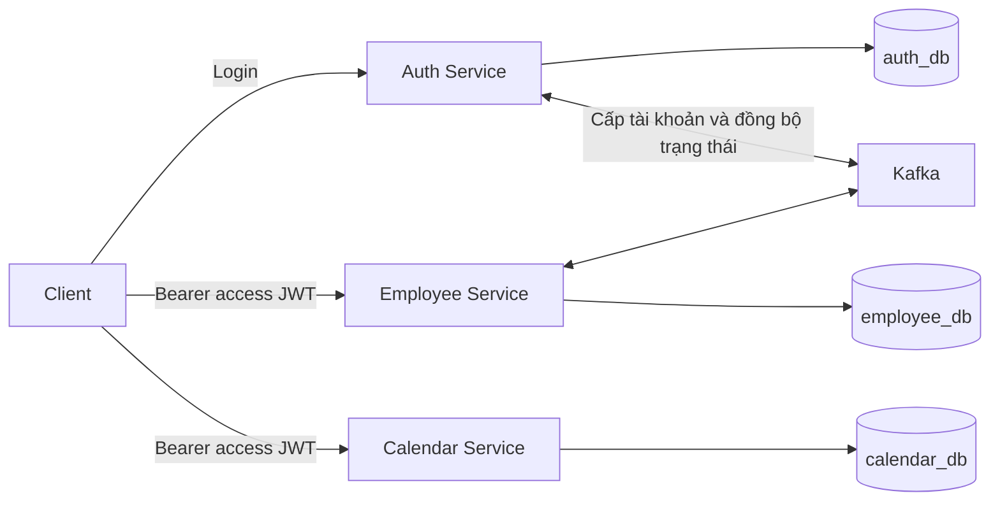

# Calendar Service — Thiết kế Holiday và sự kiện công ty

## 1. Trạng thái và phạm vi

`calendar-service` là microservice sở hữu ngày nghỉ chung và sự kiện nội bộ của công ty. **ADMIN và HR có cùng quyền quản lý CRUD, công bố và hủy sự kiện.** EMPLOYEE và MANAGER được xem sự kiện theo phạm vi cho phép.

Đã triển khai API đọc `GET /api/v1/calendar?year=2026`: controller → service → Spring Data JPA repository → entity `CalendarEvent` → PostgreSQL `calendar_events`. Response dùng `CalendarResponse` và `CalendarEventResponse`; không đọc file JSON hoặc các bảng import. JPA validate entity theo schema tạo thủ công bằng `docs/sql/001_calendar_schema.sql`.

API đọc yêu cầu Bearer access JWT hợp lệ do Auth phát hành. Mọi tài khoản đã đăng nhập (EMPLOYEE, MANAGER, HR, ADMIN) đều được xem; không yêu cầu quyền quản lý. Chỉ trả `PUBLISHED`/`CANCELLED` với audience `ALL`. Swagger UI, tài liệu OpenAPI và health vẫn công khai; các endpoint còn lại bị từ chối. Đã triển khai CRUD và công bố/hủy tại `/api/v1/calendar-events`, chỉ HR/ADMIN được truy cập, bao gồm list/detail quản trị. Mọi thay đổi ghi audit trong cùng transaction; API đọc audit **chưa triển khai**. Frontend gọi API này qua phiên đăng nhập, gửi access token và refresh một lần khi nhận `401`.

Response gồm `year`, `availableYears`, `events`. Mỗi event trả các trường nghiệp vụ theo DB: `id`, `title`, `description`, `type`, `holidayKind`, `allDay`, `startDate`, `endDate`, `startAt`, `endAt`, `timezone`, `location`, `status`, `audienceType`. Không trả actor, version hoặc metadata import. Không còn contract mock `company`, `calendars`, `legend`, `category`, `details`, `name_ja`.

`year` mặc định là năm hiện tại tại `Asia/Ho_Chi_Minh`, giới hạn 1900–2100. Truy vấn lấy mọi sự kiện giao với năm; giữ nguyên khoảng ngày/giờ gốc trong DTO. `availableYears` bao gồm các năm có sự kiện hiển thị cho nhân viên, năm được chọn và năm hiện tại. Nếu DB chưa có sự kiện hiển thị cho nhân viên, API trả `events: []`; không nạp dữ liệu mẫu để bù.

Xem [hướng dẫn SQL](docs/sql/README.md) để khởi tạo schema bằng SQL thuần trong query editor. File seed SQL chèn trực tiếp dữ liệu vào `calendar_events` và ghi audit; không dùng bảng import.

Phạm vi phiên bản đầu:

- Một công ty, lịch nghiệp vụ dùng timezone `Asia/Ho_Chi_Minh`.
- Holiday cả ngày và sự kiện công ty cả ngày hoặc có giờ.
- Audience `ALL`: áp dụng toàn công ty.
- Tạo nháp, đọc, sửa, công bố, hủy; xóa vật lý chỉ cho bản nháp.
- Phân quyền backend, lọc dữ liệu theo quyền, optimistic locking và audit.
- REST đồng bộ và PostgreSQL; chưa cần tích hợp Kafka riêng cho Calendar.

Chưa triển khai: audience phòng ban/team/role/nhân viên cụ thể, recurring event, nghỉ nửa ngày, đăng ký tham gia, nhắc lịch, tính công, tính phép hoặc gửi thông báo. Các loại audience và tích hợp này thuộc roadmap, không được nhận như tính năng khả dụng trong API đầu tiên.

## 2. Kiến trúc và quyền sở hữu dữ liệu

Hệ thống dùng microservices trong cùng repository. Auth và Employee đã có implementation và trao đổi sự kiện qua Kafka; Calendar đang được bổ sung.



API Gateway chưa có trong repository, không phải điều kiện để triển khai CRUD Calendar. Khi triển khai qua reverse proxy, định tuyến `/api/v1/calendar-events` đến Calendar; không đưa API này vào frontend history fallback.

| Thành phần                            | Dữ liệu và trách nhiệm sở hữu                                             |
| ------------------------------------- | ------------------------------------------------------------------------- |
| Auth                                  | Tài khoản, mật khẩu, vai trò, phát JWT và phiên đăng nhập                 |
| Employee                              | Hồ sơ nhân viên, phòng ban, chức danh, quan hệ quản lý                    |
| Calendar                              | Sự kiện, Holiday, trạng thái công bố, phạm vi áp dụng và lịch sử thay đổi |
| Attendance / Leave tương lai          | Phân ca, công, đơn nghỉ và số dư phép theo domain tương ứng               |
| Announcement / Notification tương lai | Nội dung thông báo và việc gửi email/push/in-app                          |

Calendar không query database khác hoặc tạo foreign key xuyên service. Auth xác thực đăng nhập; Calendar tự xác minh JWT và quyết định quyền trên dữ liệu Calendar. Việc không quản lý login không có nghĩa Calendar bỏ kiểm tra xác thực.

## 3. Quyền truy cập

| Thao tác                               | ADMIN / HR | EMPLOYEE / MANAGER           |
| -------------------------------------- | ---------- | ---------------------------- |
| Tạo sự kiện nháp                       | Có         | Không                        |
| Xem nháp và mọi trạng thái             | Có         | Không                        |
| Sửa sự kiện theo quy tắc vòng đời      | Có         | Không                        |
| Công bố, hủy sự kiện                   | Có         | Không                        |
| Xóa nháp                               | Có         | Không                        |
| Xem lịch đã công bố và sự kiện đã hủy  | Có         | Có, trong audience được phép |
| Xem audit và danh tính người chỉnh sửa | Có         | Không                        |

ADMIN và HR được quản lý cả sự kiện do người khác tạo trong công ty. Không giới hạn mỗi người chỉ sửa bản ghi của mình. Người có nhiều role được áp dụng quyền quản lý nếu có ADMIN hoặc HR.

Yêu cầu thực thi:

- Kiểm tra quyền ở backend cho từng endpoint; ẩn nút trên UI chỉ phục vụ trải nghiệm.
- Bật method security; các nghiệp vụ ghi và đọc audit yêu cầu `hasAnyRole('ADMIN', 'HR')`.
- Danh sách và chi tiết đều áp dụng quyền xem. Nhân viên truy cập ID của bản nháp nhận `404`; không trả nội dung rồi mới lọc trên frontend.
- Query `status=DRAFT` từ người chỉ có quyền xem bị từ chối `403`. Mặc định họ chỉ nhận `PUBLISHED` và `CANCELLED`.
- Sự kiện bị hủy vẫn hiển thị với nhãn “Đã hủy” để người đã xem lịch biết thay đổi, nhưng không được tính là ngày nghỉ có hiệu lực.
- DTO dành cho nhân viên không chứa audit, danh tính người sửa hoặc lý do hủy nội bộ.
- MVP chỉ chấp nhận `audienceType=ALL`; giá trị khác trả `400`. Khi mở rộng audience, bắt buộc kiểm tra cả status và membership ở list, detail, export và Holiday lookup.

## 4. Contract xác thực với Auth

Calendar hoạt động như OAuth2 Resource Server, kế thừa contract access JWT đang được Employee sử dụng:

- Bearer token ở header `Authorization`; không nhận token qua query parameter.
- Xác minh chữ ký RS256 bằng access public key của Auth, issuer `auth-service`, audience chứa `hrm-api-access`.
- `exp` bắt buộc còn hạn; kiểm tra `nbf` nếu có.
- `sub` là ID tài khoản không rỗng; `employee_id` là UUID hợp lệ; `roles` là mảng role hợp lệ, không rỗng.
- Claim `type` có thể vắng mặt hoặc bằng `access`; từ chối refresh token.
- Ánh xạ claim `roles` thành authority `ROLE_ADMIN`, `ROLE_HR`, `ROLE_EMPLOYEE`, `ROLE_MANAGER`.
- Không copy private key hoặc dùng refresh public key. Thiếu/sai access public key phải làm service khởi động thất bại.
- API stateless; public health tối thiểu và tài liệu Swagger. API nghiệp vụ yêu cầu xác thực, đường dẫn ngoài contract bị từ chối.

Không gọi Auth cho mỗi request. Do xác minh JWT cục bộ, logout hoặc đổi role tại Auth không tự thu hồi ngay access token đã phát hành. Calendar có giới hạn này tương tự Employee; không mô tả đây là kiểm tra trạng thái tài khoản tức thời.

Tham khảo implementation trong [Employee SecurityConfig](../employee-service/src/main/java/com/company/employee/config/SecurityConfig.java), [AccessTokenClaimsValidator](../employee-service/src/main/java/com/company/employee/security/AccessTokenClaimsValidator.java) và [JWT của Auth](../auth-service-main/docs/asymmetric-jwt.md).

## 5. Loại sự kiện và Holiday

`CalendarEventType`:

```text
HOLIDAY | COMPANY_MEAL | TEAM_BUILDING | TRAINING | MEETING | COMPANY_EVENT | OTHER
```

`HOLIDAY` là ngày nghỉ chung, phải có `allDay=true` và `holidayKind` thuộc:

```text
PUBLIC_HOLIDAY | COMPANY_DAY_OFF | SUBSTITUTE_DAY_OFF
```

Sự kiện khác phải có `holidayKind=null`. Company meal, training hoặc meeting không tự biến thành ngày nghỉ và không thay đổi công/phép.

Calendar lưu những ngày nghỉ do ADMIN/HR nhập và công bố; chưa tự suy ra ngày nghỉ bù, lịch âm hoặc ngày nghỉ năm sau. Holiday không tạo leave request, không trừ phép. Các quy tắc trả lương hoặc tính công ngày lễ thuộc nghiệp vụ sau này, không suy ra chỉ từ event type.

Các sự kiện được phép trùng thời gian. Nhiều Holiday trùng ngày được trả đầy đủ để đối chiếu; consumer tính nghỉ theo hợp các ngày áp dụng, không cộng lặp một ngày nhiều lần. Tiêu đề không phải khóa duy nhất.

## 6. Mô hình thời gian

Một sự kiện dùng đúng một trong hai kiểu thời gian:

| Kiểu                    | Trường bắt buộc        | Trường phải null       | Biên thời gian                   |
| ----------------------- | ---------------------- | ---------------------- | -------------------------------- |
| Cả ngày (`allDay=true`) | `startDate`, `endDate` | `startAt`, `endAt`     | Bao gồm cả ngày đầu và ngày cuối |
| Có giờ (`allDay=false`) | `startAt`, `endAt`     | `startDate`, `endDate` | Khoảng nửa mở `[startAt, endAt)` |

- Cả ngày: Java `LocalDate`, PostgreSQL `DATE`, `endDate >= startDate`.
- Có giờ: API nhận ISO-8601 có offset, lưu Java `Instant` và PostgreSQL `TIMESTAMPTZ`, `endAt > startAt`. Response chuẩn hóa thời điểm về UTC.
- `timezone` lưu `Asia/Ho_Chi_Minh` trong MVP, dùng để diễn giải lịch và hiển thị. Không nhận timezone khác cho đến khi hỗ trợ nhiều lịch.
- Timestamp audit dùng `Instant`/`TIMESTAMPTZ`, thời gian từ backend.
- Ví dụ Holiday một ngày: `startDate=endDate=2026-09-02`. Ví dụ buổi trưa: `2026-10-20T11:30:00+07:00` đến `2026-10-20T13:30:00+07:00`.
- Không lưu ngày nghỉ bằng `00:00–23:59:59`, không nhận datetime thiếu offset cho sự kiện có giờ.

GET theo `from`/`to` nhận ngày địa phương, gồm cả hai đầu. Chuyển thành `rangeStart = đầu ngày from`, `rangeEnd = đầu ngày sau to` tại timezone nghiệp vụ:

```text
Cả ngày: start_date <= to AND end_date >= from
Có giờ:  start_at < rangeEnd AND end_at > rangeStart
```

Nhờ đó, kỳ nghỉ bắt đầu trước tháng được chọn nhưng kéo dài sang tháng đó vẫn xuất hiện.

## 7. Vòng đời và quyền sửa/xóa

Trạng thái lưu trong database:

```text
DRAFT --publish--> PUBLISHED --cancel--> CANCELLED
  |
  +--delete--> Xóa bản nháp, giữ audit
```

Không lưu `COMPLETED` trong MVP. Trạng thái “Đã kết thúc” là thông tin suy ra từ thời gian, không làm mất ý nghĩa đã công bố của Holiday quá khứ. Không cần worker tự chuyển trạng thái.

| Trạng thái                     | Sửa nội dung          | Publish | Cancel                | Delete vật lý |
| ------------------------------ | --------------------- | ------- | --------------------- | ------------- |
| DRAFT                          | Có                    | Có      | Không                 | Có            |
| PUBLISHED, chưa bắt đầu        | Có, cần lý do         | Không   | Có, cần lý do         | Không         |
| PUBLISHED, đã bắt đầu/kết thúc | Chưa hỗ trợ trong MVP | Không   | Chưa hỗ trợ trong MVP | Không         |
| CANCELLED                      | Không                 | Không   | Không                 | Không         |

Quy tắc bổ sung:

- Backend cấp trạng thái `DRAFT` khi tạo; request không tự gán trạng thái.
- Khi publish, thời điểm bắt đầu phải chưa qua; sự kiện cả ngày phải có `startDate >= hôm nay` theo timezone nghiệp vụ. Khi đã công bố, sự kiện cả ngày được coi là đã bắt đầu từ đầu ngày đó.
- Sửa sự kiện đã công bố chỉ khi thời điểm bắt đầu cũ và mới đều ở tương lai; giữ nguyên type, holidayKind, allDay và audience. Muốn đổi các thuộc tính đó phải hủy và tạo bản khác.
- Sửa nội dung không thay trạng thái; chỉ publish/cancel mới chuyển trạng thái.
- Mọi hành động ghi kiểm tra version và điều kiện vòng đời trong transaction, kể cả khi nhiều người thao tác đồng thời.
- Gọi lại publish/cancel không tự tạo lần chuyển trạng thái thứ hai. Nếu response bị mất, client đọc lại trước khi quyết định thao tác tiếp.
- Quản lý dữ liệu lịch sử/import lịch cũ cần workflow riêng sau này; không dùng PUT để sửa ngầm lịch đã áp dụng.

Khi tích hợp Attendance/Leave, mở rộng điều chỉnh quá khứ bằng revision có ngày hiệu lực, lý do và đối soát kỳ liên quan. Dữ liệu công đã chốt không được tự tính lại khi Calendar thay đổi.

## 8. Database và audit

Calendar sở hữu `calendar_db`. Giữ `BIGINT` cho ID sự kiện theo thiết kế ban đầu; ID này độc lập với UUID nhân viên. Actor audit lưu nguyên `sub` dưới dạng chuỗi, không foreign key sang Auth.

Schema đã có trong [001_calendar_schema.sql](docs/sql/001_calendar_schema.sql):

```sql
CREATE TABLE calendar_events (
    id BIGINT GENERATED BY DEFAULT AS IDENTITY PRIMARY KEY,
    title VARCHAR(255) NOT NULL CHECK (length(btrim(title)) > 0),
    description TEXT,
    type VARCHAR(50) NOT NULL CHECK (type IN
        ('HOLIDAY', 'COMPANY_MEAL', 'TEAM_BUILDING', 'TRAINING',
         'MEETING', 'COMPANY_EVENT', 'OTHER')),
    holiday_kind VARCHAR(50),
    all_day BOOLEAN NOT NULL,
    start_date DATE,
    end_date DATE,
    start_at TIMESTAMPTZ,
    end_at TIMESTAMPTZ,
    timezone VARCHAR(64) NOT NULL DEFAULT 'Asia/Ho_Chi_Minh'
        CHECK (timezone = 'Asia/Ho_Chi_Minh'),
    location VARCHAR(255),
    status VARCHAR(20) NOT NULL DEFAULT 'DRAFT'
        CHECK (status IN ('DRAFT', 'PUBLISHED', 'CANCELLED')),
    audience_type VARCHAR(30) NOT NULL DEFAULT 'ALL'
        CHECK (audience_type = 'ALL'),
    version BIGINT NOT NULL DEFAULT 0 CHECK (version >= 0),
    created_by VARCHAR(255) NOT NULL,
    updated_by VARCHAR(255) NOT NULL,
    created_at TIMESTAMPTZ NOT NULL DEFAULT CURRENT_TIMESTAMP,
    updated_at TIMESTAMPTZ NOT NULL DEFAULT CURRENT_TIMESTAMP,
    CHECK (
        (all_day AND start_date IS NOT NULL AND end_date IS NOT NULL
            AND end_date >= start_date AND start_at IS NULL AND end_at IS NULL)
        OR
        (NOT all_day AND start_at IS NOT NULL AND end_at IS NOT NULL
            AND end_at > start_at AND start_date IS NULL AND end_date IS NULL)
    ),
    CHECK (
        (type = 'HOLIDAY' AND all_day AND holiday_kind IS NOT NULL
            AND holiday_kind IN ('PUBLIC_HOLIDAY', 'COMPANY_DAY_OFF', 'SUBSTITUTE_DAY_OFF'))
        OR (type <> 'HOLIDAY' AND holiday_kind IS NULL)
    )
);

CREATE TABLE calendar_event_audit (
    id BIGINT GENERATED BY DEFAULT AS IDENTITY PRIMARY KEY,
    calendar_event_id BIGINT NOT NULL,
    action VARCHAR(20) NOT NULL CHECK (action IN
        ('CREATE', 'UPDATE', 'PUBLISH', 'CANCEL', 'DELETE')),
    actor_user_id VARCHAR(255) NOT NULL,
    occurred_at TIMESTAMPTZ NOT NULL DEFAULT CURRENT_TIMESTAMP,
    reason VARCHAR(1000),
    before_data JSONB,
    after_data JSONB
);

CREATE INDEX calendar_events_all_day_range_idx
    ON calendar_events (start_date, end_date) WHERE all_day;
CREATE INDEX calendar_events_timed_range_idx
    ON calendar_events (start_at, end_at) WHERE NOT all_day;
CREATE INDEX calendar_event_audit_event_idx
    ON calendar_event_audit (calendar_event_id, occurred_at, id);
```

Các index là điểm khởi đầu, cần kiểm chứng bằng query plan và dữ liệu thực; không tạo index riêng cho mọi enum chỉ vì trường đó được lọc.

[Seed SQL](docs/sql/002_calendar_seed.sql) chèn trực tiếp 26 bản ghi lịch vào `calendar_events`, trạng thái ban đầu `PUBLISHED`, và ghi audit `CREATE`. Khi chạy lại, seed công bố các bản ghi do seed tạo còn `DRAFT`, version 0 và nội dung chưa chỉnh sửa, kèm audit `PUBLISH`. Không dùng JSON nguồn hoặc bảng import. Cách chạy seed và kiểm tra nằm trong [hướng dẫn SQL](docs/sql/README.md).

Audit không có foreign key bắt buộc về event để giữ lịch sử sau khi xóa nháp. Không có API sửa/xóa audit. Lưu snapshot trước/sau, version, actor và lý do trong cùng transaction với thay đổi:

- CREATE: `before_data=null`.
- UPDATE/PUBLISH/CANCEL: lưu trước và sau.
- DELETE: `after_data=null`, giữ snapshot nháp trước khi xóa.
- Lý do bắt buộc khi sửa sự kiện đã công bố hoặc hủy; actor lấy từ JWT, không nhận từ body.

Entity dùng `@Version`. Backend cập nhật `updated_at`/`updated_by` mỗi thay đổi; `DEFAULT CURRENT_TIMESTAMP` chỉ có tác dụng lúc insert, không tự cập nhật khi UPDATE. Khi delete, cần flush để phát hiện xung đột optimistic locking trước khi trả thành công. Lỗi nghiệp vụ hoặc ghi audit làm rollback toàn transaction.

## 9. REST API

Prefix thống nhất: `/api/v1/calendar-events`.

| Method | Endpoint                               | Quyền / kết quả                                       |
| ------ | -------------------------------------- | ----------------------------------------------------- |
| POST   | `/api/v1/calendar-events`              | ADMIN/HR; `201`, Location và ETag                     |
| GET    | `/api/v1/calendar-events`              | ADMIN/HR; danh sách quản trị gồm bản nháp    |
| GET    | `/api/v1/calendar-events/{id}`         | ADMIN/HR; chi tiết quản trị, `200`, ETag                      |
| PUT    | `/api/v1/calendar-events/{id}`         | ADMIN/HR; thay toàn bộ nội dung được phép sửa         |
| PATCH  | `/api/v1/calendar-events/{id}/publish` | ADMIN/HR; công bố nháp                                |
| PATCH  | `/api/v1/calendar-events/{id}/cancel`  | ADMIN/HR; hủy sự kiện đã công bố chưa bắt đầu         |
| DELETE | `/api/v1/calendar-events/{id}`         | ADMIN/HR; xóa nháp, `204`                             |
| GET    | `/api/v1/calendar-events/{id}/audit`   | **Chưa triển khai**; dự kiến ADMIN/HR |

Nhân viên tiếp tục xem lịch đã công bố tại `GET /api/v1/calendar`; không truy cập list/detail quản trị.

### Request tạo và sửa

Ví dụ tạo Holiday (ngày minh họa; chỉ publish khi đáp ứng quy tắc thời gian):

```json
{
    "title": "Ngày nghỉ công ty",
    "description": "Lịch nghỉ do công ty công bố",
    "type": "HOLIDAY",
    "holidayKind": "COMPANY_DAY_OFF",
    "allDay": true,
    "startDate": "2027-01-15",
    "endDate": "2027-01-15",
    "startAt": null,
    "endAt": null,
    "timezone": "Asia/Ho_Chi_Minh",
    "location": null,
    "audienceType": "ALL"
}
```

PUT gửi đầy đủ các trường nội dung như POST; trường tùy chọn bị bỏ qua hoặc null sẽ được xóa, không giữ ngầm giá trị cũ. Khi sửa sự kiện đã công bố, thêm `reason` không rỗng. Nếu cần update một phần trong tương lai, thiết kế PATCH riêng.

Validation: trim chuỗi; title 1–255 ký tự, description tối đa 10.000, location tối đa 255, reason tối đa 1.000; kiểm tra enum và tổ hợp thời gian. Từ chối các trường do server quản lý như id/status/version/actor/timestamp trong body ghi. Response quản trị có `id`, nội dung, `status`, `version`, `createdBy`, `updatedBy`, `createdAt`, `updatedAt`; metadata audit chỉ có trong DTO quản trị.

Publish không cần body; cancel nhận `{"reason":"Thay đổi kế hoạch tổ chức"}`. Publish/cancel trả `200` với bản ghi và ETag mới.

### Version bắt buộc cho mọi thay đổi trên bản ghi có sẵn

GET chi tiết và response ghi trả ví dụ:

```http
ETag: "2"
```

Response cũng chứa `version: 2`. PUT, publish, cancel và DELETE bắt buộc gửi:

```http
If-Match: "2"
```

Chỉ chấp nhận một strong ETag có version số nguyên không âm; không nhận `*`, weak ETag hoặc danh sách ETag.

- Thiếu header: `428 Precondition Required`; sai định dạng: `400`.
- Version không khớp hoặc xung đột optimistic locking khi flush/commit: `412 Precondition Failed`.
- Backend tải entity, kiểm tra version client và ghi bằng `@Version`. Chỉ có `@Version` mà không kiểm tra version từ client không bảo vệ được form cũ.
- Version tăng sau thay đổi thành công; audit snapshot sau thay đổi phải phản ánh version đã flush.
- Khi mất response, đọc lại bản ghi; không tự lấy version mới rồi gửi lại dữ liệu cũ.

ETag ở đây chỉ dùng kiểm soát ghi đồng thời trên tài nguyên, không triển khai cache `304` trong MVP. Mỗi bản ghi trong list cũng trả version để UI thao tác có điều kiện.

POST tạo mới chưa bảo đảm idempotency khi retry sau mất response. UI khóa nút trong lúc gửi và không tự retry POST; không coi title là khóa chống trùng. Idempotency-Key cho tạo mới có thể bổ sung nếu cần retry an toàn xuyên reload.

### Query danh sách

```http
GET /api/v1/calendar-events?from=2027-01-01&to=2027-01-31&type=HOLIDAY&page=0&size=20
```

- `from` và `to` bắt buộc, định dạng `YYYY-MM-DD`, `from <= to`, tối đa 366 ngày gồm hai đầu.
- `type`, `status` tùy chọn, kiểm tra enum. Không cho client bỏ qua bộ lọc quyền bằng query.
- `page >= 0`, `size` từ 1–100, mặc định 20.
- Ưu tiên `DRAFT` trước các trạng thái khác. Trong mỗi nhóm, sắp theo khoảng cách tuyệt đối từ ngày bắt đầu đến hôm nay tại `Asia/Ho_Chi_Minh` (cả quá khứ và tương lai). Khi bằng khoảng cách, sắp thời điểm bắt đầu tăng dần rồi `id`. Thứ tự được áp dụng trước phân trang.
- Response gồm `content`, `page`, `size`, `totalElements`, `totalPages`.
- Audit dùng cùng giới hạn phân trang, thứ tự `occurred_at DESC, id DESC`.

### Lỗi

Dùng Problem Detail tương tự Employee. Mã chính: `400` validation, `401` JWT thiếu/sai, `403` không đủ quyền, `404` không tồn tại/không được xem, `409` vi phạm vòng đời, `412` xung đột version, `428` thiếu precondition. Không lộ SQL, token hoặc stack trace trong response.

## 10. Holiday lookup và tích hợp Attendance/Leave — chưa triển khai

API CRUD/list ở trên đủ để xem Holiday trong MVP. Chưa mở endpoint `/internal` khi chưa có consumer và cơ chế xác thực service-to-service.

Contract dự kiến sau này:

```http
GET /internal/v1/holidays?date=2027-01-15
```

```json
{
    "date": "2027-01-15",
    "timezone": "Asia/Ho_Chi_Minh",
    "isHoliday": true,
    "holidays": [
        {
            "calendarEventId": 15,
            "version": 3,
            "title": "Ngày nghỉ công ty",
            "holidayKind": "COMPANY_DAY_OFF"
        }
    ]
}
```

Chỉ chọn `type=HOLIDAY`, `status=PUBLISHED`, ngày yêu cầu thuộc khoảng áp dụng. Ngày nghỉ đã kết thúc vẫn được tra cứu; draft/cancelled không có hiệu lực. Không có kết quả trả `isHoliday=false`, `holidays=[]`. Nhiều Holiday cùng ngày trả danh sách, không chọn tùy ý một bản ghi.

Trước khi triển khai lookup phải chốt:

- Xác thực service caller và quyền đọc, không public endpoint chỉ vì mang tên `/internal`.
- Khi thêm audience, tra cứu theo nhân viên/lịch/địa điểm đã xác minh; không dùng boolean toàn công ty cho phạm vi khác nhau.
- Attendance/Leave lưu snapshot hoặc revision đã áp dụng. Lookup dữ liệu hiện tại không đủ để tái hiện lịch trước một lần hủy/sửa.
- Timeout/downstream lỗi không được diễn giải thành “ngày làm việc”; consumer phải có chính sách retry hoặc trạng thái chưa xác định.

## 11. Kafka và outbox

Kafka đã tồn tại cho Auth–Employee. POM Calendar hiện cũng khai báo Kafka starter, nhưng chưa có topic, listener, publisher hoặc nghiệp vụ Calendar dùng Kafka. CRUD Calendar giai đoạn này xử lý REST và database, không cần broker để hoàn tất một request.

Khi có consumer thực tế, dùng hạ tầng Kafka hiện có và thiết kế outbox ngay từ lần đầu phát event nghiệp vụ:

```text
Một transaction: cập nhật CalendarEvent + audit + event_outbox
Sau commit: worker claim outbox → Kafka → ghi nhận gửi/retry
```

Event envelope cần phân biệt ID message và ID bản ghi Calendar:

```json
{
    "eventId": "910db029-2870-4ed7-9de8-e4a498b624fd",
    "eventType": "CalendarEventUpdated",
    "schemaVersion": 1,
    "occurredAt": "2026-09-30T08:30:00Z",
    "producer": "calendar-service",
    "data": {
        "calendarEventId": 15,
        "aggregateVersion": 3
    }
}
```

Đây là envelope minh họa; payload nghiệp vụ đầy đủ cần được chốt cùng consumer trước khi triển khai. `eventId` duy nhất cho mỗi message, giữ nguyên khi retry; `calendarEventId` định danh sự kiện lịch; `schemaVersion` và `aggregateVersion` có mục đích khác nhau.

Quy tắc: key theo calendarEventId, consumer chống trùng, xử lý version cũ/sự kiện đến sai thứ tự, retry có kiểm soát và DLT/giám sát khi cần. Không có đảm bảo exactly-once chỉ nhờ producer idempotence. Domain events dự kiến gồm Published, Updated (sau công bố), Cancelled; thay đổi nháp không phát cho consumer thông báo nhân viên.

Không gửi email hoặc gọi Notification trong transaction Calendar. Calendar không cần chờ Announcement/Notification/Attendance tồn tại để triển khai CRUD.

## 12. Audience mở rộng — roadmap

Sau MVP có thể bổ sung `DEPARTMENT`, `TEAM`, `ROLE`, `SPECIFIC_EMPLOYEES`, nhưng cần mở rộng cả lưu trữ, API và phân quyền:

- Dùng bảng target liên kết event với nhiều đối tượng; không nhét danh sách ID vào một `audienceRef` hoặc dùng mã phòng ban có thể đổi làm định danh.
- Employee/department tham chiếu UUID, role tham chiếu enum. TEAM chỉ bật khi Employee/Organization có mô hình team và contract thật.
- Chốt audience theo membership hiện tại hay snapshot lúc công bố; thay đổi phòng ban có thể thay đổi quyền xem tùy chính sách đã chọn.
- Membership phải lấy từ nguồn tin cậy. Access JWT hiện không cung cấp department/team, nên không tự suy ra từ role hoặc dữ liệu client gửi.
- Khi Employee không truy cập được, không mặc định mở quyền xem sự kiện giới hạn.
- HTTP contract nội bộ của Employee và cơ chế xác thực giữa các service phải được xây trước; các endpoint `/internal/employees` và `/internal/departments` chưa tồn tại trong contract hiện tại.

## 13. Stack và cấu trúc triển khai dự kiến

Nền tảng hiện có trong POM: Java 21, Spring Boot 4.1.1, Maven, Spring MVC, JPA, Validation, Security, Actuator, PostgreSQL, Lombok và Kafka. Dependency có trong POM không đồng nghĩa tính năng đã được cấu hình.

POM đã dùng `spring-boot-starter-security-oauth2-resource-server`. Xác minh JWT đã áp dụng cho API đọc lịch; CRUD và công bố/hủy chỉ cho HR/ADMIN.

Cấu trúc luồng đọc đã triển khai:

```text
src/main/java/com/company/calendar_service/
├── CalendarServiceApplication.java
├── calendar/
│   ├── CalendarController.java
│   ├── CalendarService.java
│   ├── CalendarManagementController.java
│   ├── CalendarManagementService.java
│   └── CalendarErrors.java
├── entity/CalendarEvent.java
├── dto/
│   ├── CalendarResponse.java
│   └── CalendarEventResponse.java
├── enums/
├── repository/CalendarEventRepository.java
└── config/SecurityConfig.java
src/main/resources/
├── application.properties
└── static/openapi/calendar-api.yml
docs/sql/
├── 001_calendar_schema.sql
└── 002_calendar_seed.sql
```

Chưa cần interface/implementation tách đôi cho mỗi service nếu chỉ có một implementation và chưa có nhu cầu thay thế. Không tạo repository/entity dùng chung xuyên microservice.

## 14. Cấu hình và chạy local sau khi triển khai

Cấu hình hiện tại: Calendar HTTP mặc định `8083`, PostgreSQL `localhost:5432`, database `calendar_db`. Đặt `CALENDAR_DB_URL`, `CALENDAR_DB_USER`, `CALENDAR_DB_PASSWORD` để kết nối DB thực tế (ví dụ đổi port URL thành `5434` nếu DB local dùng cổng đó). `CALENDAR_PORT` đổi cổng HTTP.

Chạy từ thư mục service bằng `./mvnw spring-boot:run`, rồi gọi `GET http://localhost:8083/api/v1/calendar?year=2026` với header `Authorization: Bearer <access-token>`. Thiếu token hoặc token sai/hết hạn trả `401`. Tạo bảng bằng `docs/sql/001_calendar_schema.sql` và nạp dữ liệu bằng `docs/sql/002_calendar_seed.sql` trước khi khởi động. Hibernate chỉ validate schema, không tự tạo hoặc sửa bảng.

Swagger UI dùng cùng cách cấu hình với Employee Service: tài liệu OpenAPI YAML riêng, không cần annotation Swagger trong controller/DTO.

- Swagger UI: [http://localhost:8083/swagger-ui.html](http://localhost:8083/swagger-ui.html).
- OpenAPI YAML: [http://localhost:8083/openapi/calendar-api.yml](http://localhost:8083/openapi/calendar-api.yml).
- File tài liệu: `src/main/resources/static/openapi/calendar-api.yml`; mô tả API lịch yêu cầu đăng nhập và `/actuator/health` đang hoạt động.
- UI và tài liệu không yêu cầu token. Dùng **Authorize** để nhập access token trước khi thử API lịch. `/v3/api-docs/swagger-config` phục vụ cấu hình UI; tài liệu tự sinh `/v3/api-docs` tắt như Employee Service.

Kiểm thử bảo mật không cần PostgreSQL hoặc khóa thật: `./mvnw -Dtest=JwtSecurityTests test`. Test tự sinh cặp khóa RSA để kiểm tra JWT và phân quyền xem/quản lý.

Kiểm thử integration dùng PostgreSQL riêng. Tạo schema trên DB thử trước khi chạy; các thay đổi trong test được rollback:

```bash
psql -X -v ON_ERROR_STOP=1 -h localhost -p 5432 -U calendar_test -d calendar_test \
  -f docs/sql/001_calendar_schema.sql

CALENDAR_DB_URL=jdbc:postgresql://localhost:5432/calendar_test \
CALENDAR_DB_USER=calendar_test CALENDAR_DB_PASSWORD=your-local-test-password ./mvnw test
```

Bộ test validate entity theo schema đã tạo, đọc qua API và kiểm tra DTO, ẩn draft/actor, lịch rỗng, khoảng giao năm và biên thời gian. `CalendarManagementIntegrationTests` kiểm tra CRUD, vòng đời, version, ghi đồng thời, validation và rollback khi audit lỗi. Không chạy bộ test trên DB nghiệp vụ.

Cấu hình JWT hiện tại:

```properties
spring.application.name=calendar-service
server.port=8083
spring.datasource.url=${CALENDAR_DB_URL:jdbc:postgresql://localhost:5434/calendar_db}
spring.datasource.username=${CALENDAR_DB_USER:calendar_user}
spring.datasource.password=${CALENDAR_DB_PASSWORD}
spring.jpa.hibernate.ddl-auto=validate
spring.jpa.open-in-view=false
management.endpoints.web.exposure.include=health
management.endpoint.health.show-details=never
jwt.access-public-key=${JWT_ACCESS_PUBLIC_KEY:file:../auth-service-main/keys/access-public.pem}
jwt.access-issuer=${JWT_ACCESS_ISSUER:auth-service}
jwt.access-audience=${JWT_ACCESS_AUDIENCE:hrm-api-access}
```

Nhóm `jwt.*` được bind qua `JwtProperties` và sử dụng trong `SecurityConfig`. `JWT_ACCESS_PUBLIC_KEY` phải trỏ đến access public key của Auth; mặc định là `file:../auth-service-main/keys/access-public.pem` tính từ thư mục service. Không yêu cầu Kafka bootstrap cho luồng CRUD chưa dùng Kafka. Schema được tạo bằng script SQL; Hibernate chỉ validate schema.

Chuẩn bị PostgreSQL riêng nếu chưa có database local (đặt `CALENDAR_DB_PASSWORD` trong environment trước):

```bash
docker run --name calendar-postgres \
  -e POSTGRES_DB=calendar_db \
  -e POSTGRES_USER=calendar_user \
  -e POSTGRES_PASSWORD="$CALENDAR_DB_PASSWORD" \
  -p 127.0.0.1:5434:5432 \
  -v calendar-postgres-data:/var/lib/postgresql/data \
  -d postgres:16
```

Không chạy tạo container mới nếu đã có instance/database cần giữ. Mẫu này dùng cho local. Từ thư mục `back-end/modules/calendar-service`, sau khi hoàn thiện dependency, schema SQL, security và business code:

```bash
./mvnw test
./mvnw clean package
./mvnw spring-boot:run
```

JAR theo artifactId/version hiện tại, nếu không đổi `finalName`:

```bash
java -jar target/calendar-service-0.0.1-SNAPSHOT.jar
```

Service cần access public key đúng, database sẵn sàng và biến môi trường trong chính tiến trình khởi động; Spring Boot không tự đọc `.env`. Nếu đóng gói Docker sau này, `localhost` bên trong container không trỏ đến PostgreSQL trên host; đặt `CALENDAR_DB_URL` tới địa chỉ database truy cập được và mount public key. Hiện chưa có Dockerfile/Compose cho Calendar.

## 15. Thứ tự triển khai và nghiệm thu

1. Chuẩn hóa dependency, port/database/public key, cấu hình Resource Server; kiểm tra build.
2. Chạy `docs/sql/001_calendar_schema.sql`; xây entity có `@Version`, repository và audit. Chạy kiểm tra SQL trên PostgreSQL trước khi nối nghiệp vụ.
3. Xây CRUD, publish/cancel, ETag và xử lý lỗi; giữ transaction theo nghiệp vụ.
4. Xây query khoảng thời gian và lọc quyền ở list/detail/audit.
5. Nối UI quản lý cho ADMIN và HR; giao diện xem lịch cho EMPLOYEE/MANAGER. Khi gặp `412`, yêu cầu tải lại và so sánh, không tự ghi đè.
6. Nghiệm thu các trường hợp dưới đây trước khi coi tính năng hoàn thành.

Các kiểm thử bắt buộc:

- ADMIN và HR đều CRUD/publish/cancel được đúng vòng đời; EMPLOYEE/MANAGER không ghi hoặc đọc audit.
- JWT giả, hết hạn, sai issuer/audience, refresh token bị từ chối; role lấy từ claim Auth.
- Người chỉ xem không đọc được draft qua list, filter hoặc đoán ID; thấy nhãn canceled nhưng canceled không được coi là Holiday hiệu lực.
- Holiday nhiều ngày, sự kiện qua ngày, biên cuối tháng/năm, offset và query giao khoảng cho kết quả đúng.
- Payload trộn ngày/giờ, Holiday có giờ, enum/audience không hỗ trợ và ngày kết thúc sai bị từ chối.
- Hai người sửa cùng version: chỉ một ghi thành công, bên còn lại nhận `412`. Form cũ gửi sau khi người khác đã commit cũng nhận `412`.
- Publish/cancel/delete đồng thời không vượt vòng đời. Không sửa/hủy published đã bắt đầu, không xóa published/cancelled.
- Audit lưu đủ trước/sau/actor/reason/version; lỗi ghi audit rollback thay đổi; xóa nháp vẫn đọc được lịch sử bởi ADMIN/HR.
- Script tạo bảng chạy trên PostgreSQL sạch, Hibernate validate được schema; constraint, JSONB và concurrency được kiểm chứng trên PostgreSQL, không chỉ H2.

Các bước sau MVP là audience mở rộng, consumer Holiday/Attendance/Leave, rồi Kafka/outbox khi có nghiệp vụ sử dụng. Hệ thống Auth–Employee vẫn tiếp tục dùng Kafka hiện có trong suốt quá trình này.
