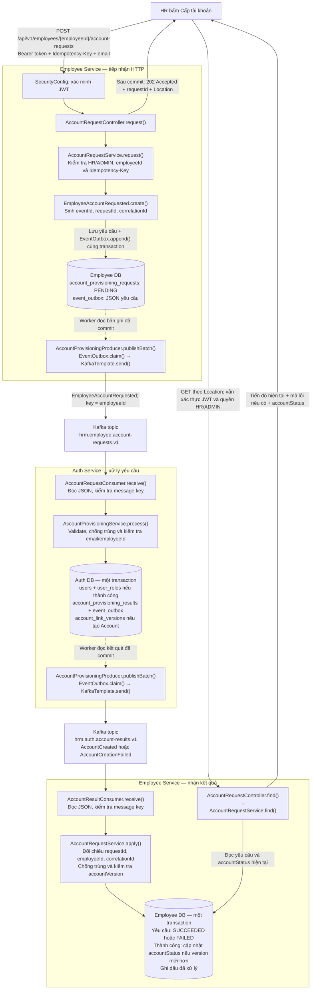

# Chạy luồng yêu cầu cấp tài khoản

Đã có hai chiều: Employee nhận yêu cầu → Outbox → Kafka → Auth tạo Account hoặc
trả lỗi → Outbox → Kafka → Employee cập nhật kết quả. Tạo hồ sơ không tự cấp Account.

Account tạo qua luồng này có `activation_pending=true`, `is_active=false`, role
`EMPLOYEE`, hash từ bí mật ngẫu nhiên riêng từng tài khoản không được giữ lại hoặc
phát ra ngoài. Đã có [email Resend, token hết hạn và API đặt mật khẩu/kích hoạt](../../auth-service-main/docs/ACCOUNT-ACTIVATION.md).
Tài khoản mới chỉ đăng nhập được sau khi hoàn tất kích hoạt. Không bật thủ công `is_active` hoặc dùng mật khẩu chung để
thay thế luồng kích hoạt; database không cho Account chờ kích hoạt trở thành active.

## 1. Database và Kafka

Chạy từ `back-end/modules`, trên database development đã có schema Employee/Auth:

```bash
psql -X -v ON_ERROR_STOP=1 -h localhost -U employee_user -d employee_db \
  -f employee-service/src/main/resources/static/sql/004_account_provisioning.sql
psql -X -v ON_ERROR_STOP=1 -h localhost -U auth_user -d auth_db \
  -f auth-service-main/docs/sql/004_account_provisioning.sql

docker compose -f infra/kafka/compose.yaml up -d
docker compose -f infra/kafka/compose.yaml run --rm kafka-init
```

Nếu Employee vẫn còn cột `has_account` hoặc giá trị `UNKNOWN`, chạy migration `003`
trước `004`. Migration không tự chạy khi start. Auth cần `004` trước khi chạy bản
code mới, kể cả khi chưa bật Kafka, vì `User` có thêm cột `activation_pending`.
Database mới: schema khởi tạo Employee đã có các bảng; script Auth `001` gọi `004`.
Không chạy Auth `001` trên database cần giữ dữ liệu: script đó reset toàn bộ Auth DB.

Topic yêu cầu: `hrm.employee.account-requests.v1`; topic kết quả:
`hrm.auth.account-results.v1`. Mỗi topic có group riêng theo bên nhận. Topic vòng
đời hiện chưa có consumer và không dùng cho yêu cầu cấp tài khoản.

## 2. Chạy hai service

Từ thư mục từng service, dùng cấu hình database và JWT như trước:

```bash
HRM_EVENTS_ENABLED=true ./mvnw spring-boot:run
```

`KAFKA_BOOTSTRAP_SERVERS` mặc định `localhost:9092`. Cờ sự kiện mặc định `false`:
worker/listener không chạy và API yêu cầu trả `503`. Khi bật cờ ở Auth, API
`POST /api/v1/auth/register` cũ trả `409`; các thao tác login/refresh hiện có vẫn
hoạt động cho Account đã active. Việc này ngăn đường tạo Account bỏ qua Outbox.

Dùng tài khoản HR/ADMIN đã có để đăng nhập; Auth seed local vẫn dùng được. JWT
Employee phải xác minh được bằng access public key của Auth. Hai API mới cho
HR/ADMIN toàn hệ thống; chưa có phạm vi theo phòng ban hoặc tenant.

## 3. Gửi yêu cầu

Tạo nhân viên qua API Employee như trước rồi dùng ID vừa nhận. Thay các biến dưới
bằng dữ liệu local của bạn; key phải là UUID mới cho thao tác cấp tài khoản mới.

```bash
curl -i -X POST "http://localhost:8082/api/v1/employees/$EMPLOYEE_ID/account-requests" \
  -H "Authorization: Bearer $ACCESS_TOKEN" \
  -H "Idempotency-Key: $IDEMPOTENCY_KEY" \
  -H 'Content-Type: application/json' \
  -d '{"email":"employee@example.com"}'
```

Phản hồi `202 Accepted`, header `Location` và body:

```json
{
  "requestId": "ad96c1d8-d0d9-477c-a47b-7aed14d46db1",
  "employeeId": "d38e31b7-0bba-420c-8eaf-50edbe5a61ae",
  "provisioningStatus": "PENDING",
  "errorCode": null,
  "accountStatus": "NOT_CREATED",
  "createdAt": "2026-09-28T03:00:00Z"
}
```

Gửi lại cùng key/người gọi và email/nhân viên sẽ nhận cùng `requestId`; đổi dữ liệu
với key cũ hoặc gửi yêu cầu mới khi còn `PENDING` trả `409`. Backend chuẩn hóa email
bằng strip và lowercase. Không truyền mật khẩu, role hoặc `requestedBy`; server
lấy người yêu cầu từ principal JWT và Auth tự gán role `EMPLOYEE`.

Đọc tiến độ qua `Location` hoặc:

```bash
curl "http://localhost:8082/api/v1/employees/$EMPLOYEE_ID/account-requests/$REQUEST_ID" \
  -H "Authorization: Bearer $ACCESS_TOKEN"
```

- Thành công: `SUCCEEDED`, `accountStatus=PENDING_ACTIVATION`.
- Email đã dùng: `FAILED`, `errorCode=EMAIL_ALREADY_USED`.
- Nhân viên đã có Account: `FAILED`, `errorCode=ACCOUNT_ALREADY_EXISTS`.
- Auth/Kafka gián đoạn: vẫn `PENDING`; Outbox/consumer retry. Không tạo lại yêu cầu
  hoặc kết luận Account chưa tồn tại chỉ vì chưa thấy kết quả.

Thất bại nghiệp vụ không xóa Employee hoặc đổi `accountStatus`. Sau khi sửa dữ liệu,
gửi yêu cầu mới với key mới. Kết quả khớp request/employee/correlation ID; version
cũ không ghi đè bản sao Account mới hơn. API sửa hồ sơ dùng dynamic update để không
ghi đè trạng thái tài khoản vừa cập nhật bởi consumer.

## 4. Kiểm thử và giới hạn

Các test mới tập trung vào service và worker: idempotency, phân quyền, rollback,
unique conflict, gửi trùng, version cũ, claim hết hạn và Kafka gửi lỗi. Giữ bộ test
hiện có; không thêm test controller cho luồng này. `KafkaConnectionTests` opt-in
kiểm tra topic yêu cầu/kết quả mới bằng cấu hình thật của từng service.

Outbox claim từng bản ghi trong transaction ngắn, lease 2 phút; gửi ngoài transaction,
chỉ đánh dấu đã gửi sau ack. Retry có backoff, tối đa 5 phút giữa hai lần; delivery
có thể trùng. Consumer hiện retry vô hạn với khoảng chờ 5 giây, không bỏ qua message
lỗi. **Chưa có DLT**, nên payload lỗi có thể chặn partition: cần kiểm tra log/Outbox
và triển khai DLT/đối soát trước production. Không xóa/reset offset tùy tiện.

Đã có kích hoạt/đặt mật khẩu và consumer `AccountStatusChanged` sau kích hoạt.
Còn thiếu: API khóa/mở tài khoản và phát sự kiện tương ứng,
đối soát dữ liệu cũ/yêu cầu treo, metric/cảnh báo, DLT và TLS/SASL/ACL production.
`producer` trong JSON và key Kafka không thay thế xác thực broker. Kafka local
PLAINTEXT chỉ dành cho phát triển; không coi đây là bản production hoàn chỉnh.

## 5. Sơ đồ từ thao tác UI đến kết quả

UI gửi **HTTP request** tới Employee; `EmployeeAccountRequested` được backend tạo
sau khi kiểm tra quyền và nhân viên. Sơ đồ giả định đã bật cờ sự kiện, cấu hình
topic và chạy migration. Đây là luồng cho một yêu cầu mới hợp lệ.



Hai hình Employee DB biểu diễn **cùng một database**, tại hai thời điểm xử lý khác
nhau. `202` được trả sau khi Employee commit yêu cầu, không chờ Kafka hoặc Auth.
Worker có thể gửi ngay sau commit; không có cam kết về thứ tự giữa việc UI nhận
HTTP response và việc Auth bắt đầu xử lý.

Chi tiết worker ở cả hai service:

```text
@Scheduled gọi publishBatch()
    → EventOutbox.claim(): transaction ngắn, giữ quyền xử lý bằng lease
    → KafkaTemplate.send(): gửi ngoài transaction database
        ├─ Broker xác nhận → EventOutbox.sent(): ghi sent_at
        └─ Lỗi/timeout → EventOutbox.retry(): hẹn lần gửi tiếp theo
```

Consumer gọi service để hoàn tất transaction trước khi listener trả về; cấu hình
ack theo record cho phép commit offset sau đó. Lỗi được ném ra để retry, không tự
chuyển thành thành công. `ProvisioningKafkaConfig` bật scheduling và cấu hình xử lý
lỗi Kafka; nó không phải một API hoặc nơi tạo Account.

Auth không nhận HTTP request trực tiếp trong flow này. UI theo dõi bằng GET/polling
tại Employee; chưa có push/WebSocket. Nếu kết quả chưa về, GET vẫn trả `PENDING`.
Khi thành công, yêu cầu là `SUCCEEDED`, còn Account đang `PENDING_ACTIVATION`.
